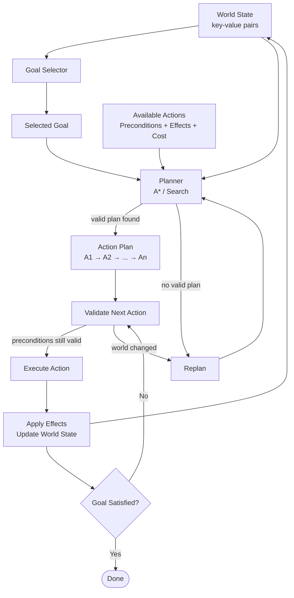

# Goal Oriented Action Planning - GOAP

> Goal Oriented Action Planning is an AI planning approach where an agent uses its current world state, available actions, and selected goal to generate a valid sequence of actions.
> The planner searches for actions whose preconditions and effects transform the current state into the desired goal state, usually selecting the lowest-cost valid path.

## Overview

GOAP allows agents to make decisions dynamically.

Instead of hardcoding a fixed behavior sequence, the agent defines or receives a goal, analyzes the current world state, and searches for a sequence of actions that can satisfy that goal.

The final result is a **plan**, which is an ordered sequence of actions that the agent can execute.

Example:

```text
Goal: DefeatEnemy

Current World State:
  hasWeapon = false
  enemyVisible = true
  enemyAlive = true

Generated Plan:
  FindWeapon()
  PickUpWeapon()
  MoveToEnemy()
  AttackEnemy()
```

## Structures

| Structure         | Meaning                                                                   |
|-------------------|---------------------------------------------------------------------------|
| **Goal**          | The desired state the agent wants to achieve                              |
| **Goal Selector** | Chooses which goal should be pursued                                      |
| **World State**   | Set of key-value pairs describing the current state of the world          |
| **Action**        | Operation the agent can perform; has preconditions, effects, and cost     |
| **Planner**       | Searches for a valid sequence of actions that satisfies the selected goal |
| **Plan**          | Final ordered list of actions generated by the planner                    |

## Concepts

### World State

The **world state** represents what the agent currently knows about itself and the environment.

It is commonly represented as a set of key-value pairs.

Example:

```text
hasWeapon = true
hasAmmo = false
enemyVisible = true
enemyAlive = true
healthLow = false
nearCover = false
```

The planner uses the world state to determine which actions are currently possible.

---

### Goal

A **goal** represents a desired world state.

Example:

```text
enemyAlive = false
```

This means the agent wants to reach a state where the enemy is defeated.

Other examples:

```text
hasAmmo = true
healthLow = false
isSafe = true
areaPatrolled = true
```

A goal does not describe how to achieve something.  
It only describes the desired result.

---

### Goal Selector

A **goal selector** decides which goal the agent should pursue.

The decision can be based on:

* current world state;
* priority;
* utility score;
* danger level;
* agent needs;
* designer-authored rules.

Example:

| World State           | Selected Goal     |
|-----------------------|-------------------|
| `healthLow = true`    | `FindHealingItem` |
| `enemyVisible = true` | `DefeatEnemy`     |
| `hasAmmo = false`     | `FindAmmo`        |
| `isIdle = true`       | `PatrolArea`      |

The goal selector chooses **what** the agent wants.

The planner decides **how** to achieve it.

---

### Action

An **action** represents something the agent can do.

Actions are usually defined by:

* **Name**
  * Identifier of the action.
  * Example: `MoveToEnemy`, `ReloadWeapon`, `AttackEnemy`.

* **Cost**
  * Numeric value used by the planner to compare possible plans.
  * Lower-cost plans are usually preferred.

* **Preconditions**
  * Conditions that must be true before the action can be executed.

* **Effects**
  * Changes applied to the world state after the action succeeds.

Example:

```text
Action: AttackEnemy

Cost:
  2

Preconditions:
  hasWeapon = true
  enemyVisible = true
  enemyInRange = true

Effects:
  enemyAlive = false
```

---

### Preconditions

**Preconditions** are the conditions required for an action to be valid.

Example:

```text
Action: ReloadWeapon

Preconditions:
  hasWeapon = true
  hasAmmoItem = true
```

If the preconditions are not satisfied, the planner cannot use the action directly.

However, it may search for another action that produces the missing condition.

Example:

```text
Missing condition:
  hasAmmoItem = true

Possible action:
  FindAmmo()
```

---

### Effects

**Effects** are the changes produced by an action.

Example:

```text
Action: PickUpWeapon

Effects:
  hasWeapon = true
```

The planner chains actions by matching effects to missing preconditions.

Example:

```text
AttackEnemy requires:
  hasWeapon = true

PickUpWeapon produces:
  hasWeapon = true
```

Therefore, `PickUpWeapon` can be planned before `AttackEnemy`.

---

### Cost

**Cost** represents how expensive, risky, slow, or undesirable an action is.

Example:

```text
Action: MeleeAttack
Cost: 2

Action: RangedAttack
Cost: 4

Action: Flee
Cost: 1
```

The planner uses cost to choose between multiple valid plans.

Example:

```text
Plan A:
  MoveToEnemy()
  MeleeAttack()
Total Cost: 4

Plan B:
  FindAmmo()
  ReloadWeapon()
  ShootEnemy()
Total Cost: 8
```

If both plans satisfy the goal, the planner usually selects the lower-cost plan.

---

## Planner

The **planner** searches for a valid sequence of actions that transforms the current world state into the goal state.

A common implementation uses graph search, such as:

* A*;
* Dijkstra;
* backward search;
* forward search.

The planner receives:

```text
Current World State
Selected Goal
Available Actions
```

And returns:

```text
Action Plan
```

Example:

```text
Current World State:
  hasWeapon = false
  weaponVisible = true
  enemyVisible = true
  enemyAlive = true

Goal:
  enemyAlive = false

Available Actions:
  PickUpWeapon
  MoveToEnemy
  AttackEnemy

Generated Plan:
  PickUpWeapon()
  MoveToEnemy()
  AttackEnemy()
```

---

## Plan

A **plan** is the final ordered sequence of actions generated by the planner.

Example:

```text
PickUpWeapon()
MoveToEnemy()
AttackEnemy()
```

The plan is valid because each action satisfies the requirements of the next action.

```text
PickUpWeapon()
  Effect: hasWeapon = true

MoveToEnemy()
  Preconditions: enemyVisible = true
  Effect: enemyInRange = true

AttackEnemy()
  Preconditions:
    hasWeapon = true
    enemyInRange = true
  Effect:
    enemyAlive = false
```

---

## Runtime Validation

Even after a plan is generated, the world can change.

Example:

```text
The enemy moves away.
The weapon is picked up by another agent.
The agent takes damage.
The path becomes blocked.
```

Because of this, actions should be validated before execution.

If the next action is no longer valid, the agent should replan.

Example:

```text
Current Plan:
  MoveToEnemy()
  AttackEnemy()

Runtime Change:
  enemyVisible = false

Result:
  Current plan is invalid.
  Agent must replan.
```

---

## Replanning

**Replanning** happens when the current plan becomes invalid or no longer useful.

Common reasons for replanning:

* preconditions are no longer satisfied;
* goal was already completed;
* goal changed;
* action failed;
* world state changed;
* higher-priority goal appeared.

Example:

```text
Original Goal:
  DefeatEnemy

New World State:
  healthLow = true

New Goal:
  FindHealingItem
```

The agent stops pursuing the previous plan and generates a new one.

---

## Diagram



---

## Example: Defeat Enemy

### Initial World State

```text
hasWeapon = false
weaponVisible = true
enemyVisible = true
enemyInRange = false
enemyAlive = true
```

### Goal

```text
enemyAlive = false
```

### Available Actions

```text
Action: PickUpWeapon

Cost:
  1

Preconditions:
  weaponVisible = true

Effects:
  hasWeapon = true
```

```text
Action: MoveToEnemy

Cost:
  2

Preconditions:
  enemyVisible = true

Effects:
  enemyInRange = true
```

```text
Action: AttackEnemy

Cost:
  2

Preconditions:
  hasWeapon = true
  enemyInRange = true

Effects:
  enemyAlive = false
```

### Generated Plan

```text
PickUpWeapon()
MoveToEnemy()
AttackEnemy()
```

### Final World State

```text
hasWeapon = true
weaponVisible = true
enemyVisible = true
enemyInRange = true
enemyAlive = false
```

The goal is satisfied because:

```text
enemyAlive = false
```

---

## Summary

| Concept                | Meaning                                                          |
|------------------------|------------------------------------------------------------------|
| **World State**        | Current facts about the agent and environment                    |
| **Goal**               | Desired state the agent wants to reach                           |
| **Goal Selector**      | Chooses which goal should be pursued                             |
| **Action**             | Operation with preconditions, effects, and cost                  |
| **Preconditions**      | Conditions required before an action can execute                 |
| **Effects**            | Changes produced after an action executes                        |
| **Cost**               | Value used to compare possible plans                             |
| **Planner**            | Searches for a valid action sequence                             |
| **Plan**               | Ordered list of actions returned by the planner                  |
| **Runtime Validation** | Checking whether the next action is still valid before execution |
| **Replanning**         | Generating a new plan when the current one becomes invalid       |