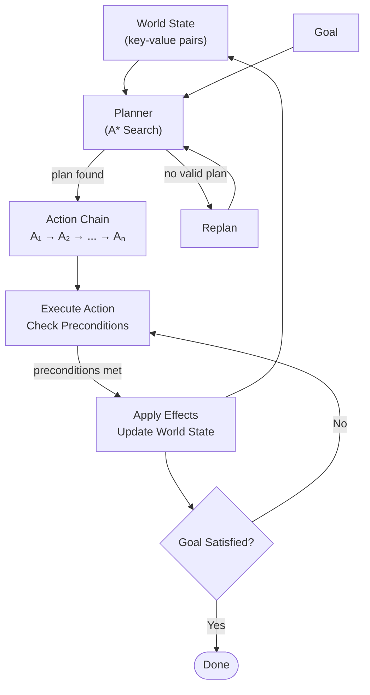

# Goal Oriented Action Planning
> GOAP is an approach where an agent evaluates its current world state to define a goal. The planner then searches for
> a sequence of actions whose preconditions and effects bridge the gap between the current state and that goal, 
> selecting the most efficient path to satisfy it.

## Structures
| Structure   | Meaning                                                                      |
|-------------|------------------------------------------------------------------------------|
| Goal        | The current objective of the agent                                           |
| World State | Set of key-value pairs describing the state of the world                     |
| Action      | Interaction with the world; has preconditions and effects                    |
| Planner     | Uses search (A*) over the World State to chain actions that satisfy the Goal |

## Concepts
* **Effects**:
  * Actions produce effects that modify the World State after execution.
* **Preconditions**:
  * Conditions that must be satisfied in the current World State for an action to be executed.
  * The planner chains actions by matching each action's effects to the preconditions of the next,
    building a valid sequence from the current state to the goal
  
## Diagram
