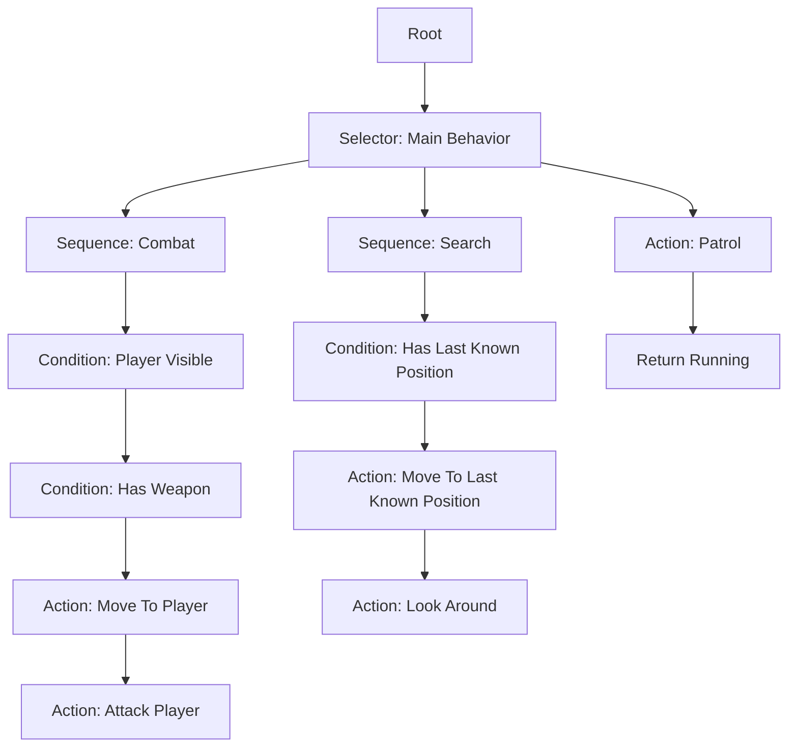
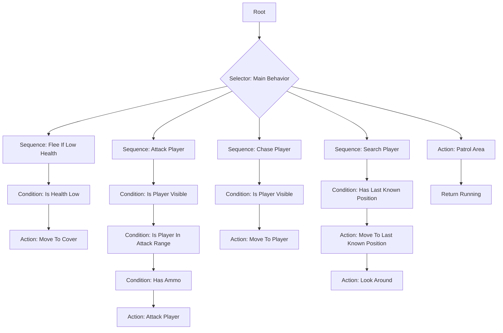

# Behavior Tree - BT

> A Behavior Tree is an AI decision-making structure used to control the behavior of agents through a hierarchy of 
> nodes.
> It is commonly used in games to organize NPC logic such as patrol, chase, attack, flee, search, investigate, and 
> interact.

## Overview

A **Behavior Tree** defines how an agent behaves by evaluating a tree of nodes.

The tree starts from a **root node** and evaluates child nodes according to specific rules.

Each node returns a status:

```text
Success
Failure
Running
````

These statuses tell the tree whether a behavior:

* completed successfully;
* failed;
* is still executing.

Example:

```text
Enemy NPC:
  If player is visible:
    Chase player
    Attack player

  Else:
    Patrol area
```

In a Behavior Tree, this logic is represented as a hierarchy of nodes.

---

# Core Concepts

## Node

A **node** is one element of the Behavior Tree.

Each node has a specific responsibility and returns a status after being evaluated.

Common node types:

| Node Type      | Meaning                                     |
|----------------|---------------------------------------------|
| **Root**       | Entry point of the Behavior Tree            |
| **Composite**  | Controls execution of multiple child nodes  |
| **Decorator**  | Modifies or guards another node             |
| **Condition**  | Checks whether something is true or false   |
| **Action**     | Performs an actual behavior                 |

---

## Tick

A **tick** is one update cycle of the Behavior Tree.

During each tick, the tree evaluates nodes and decides what the agent should do.

Example:

```text
Tick:
  Evaluate root
  Evaluate main selector
  Check if player is visible
  If true, chase player
  If false, patrol
```

In games, a Behavior Tree may be ticked:

* every frame;
* every fixed update;
* every few milliseconds;
* only when relevant events happen.

---

## Node Status

Each node returns a status.

### Success

The node completed its task successfully.

Example:

```text
MoveToCover()
  -> Success when the agent reaches cover
```

### Failure

The node could not complete its task.

Example:

```text
AttackPlayer()
  -> Failure if the player is out of range
```

### Running

The node is still executing.

Example:

```text
MoveToPlayer()
  -> Running while the agent is still moving
```

---

# Main Node Types

## Root Node

The **root node** is the starting point of the Behavior Tree.

A tree usually has one root node.

Example:

```text
Root
  -> MainBehavior
```

The root sends ticks to its child node.

---

## Composite Node

A **composite node** controls how its children are evaluated.

The most common composite nodes are:

* Sequence;
* Selector;
* Parallel.

---

# Sequence Node

A **Sequence** executes its children in order.

It succeeds only if all children succeed.

If one child fails, the sequence fails.

## Sequence Logic

```text
For each child:
  Tick child

  If child returns Failure:
    Return Failure

  If child returns Running:
    Return Running

If all children return Success:
  Return Success
```

## Example

```text
Sequence: Attack Player
  -> CheckPlayerVisible
  -> MoveToPlayer
  -> AttackPlayer
```

Meaning:

```text
If the player is visible,
move to the player,
then attack.
```

If `CheckPlayerVisible` fails, the sequence stops immediately.

---

# Selector Node

A **Selector** tries its children in order until one succeeds.

It succeeds if at least one child succeeds.

If all children fail, the selector fails.

Selectors are useful for choosing between alternative behaviors.

## Selector Logic

```text
For each child:
  Tick child

  If child returns Success:
    Return Success

  If child returns Running:
    Return Running

If all children return Failure:
  Return Failure
```

## Example

```text
Selector: Enemy Behavior
  -> Attack Player
  -> Chase Player
  -> Patrol Area
```

Meaning:

```text
Try to attack.
If attack is not possible, chase.
If chase is not possible, patrol.
```

---

# Parallel Node

A **Parallel** node runs multiple children at the same time.

It is useful when an agent needs to perform more than one behavior simultaneously.

Example:

```text
Parallel:
  -> MoveToTarget
  -> LookAtTarget
```

The exact success and failure rules depend on the implementation.

Common rules:

```text
Success if all children succeed
Failure if one child fails
```

Another possible rule:

```text
Success if at least one child succeeds
Failure if all children fail
```

Parallel nodes should be used carefully because multiple behaviors may conflict with each other.

---

# Decorator Nodes

A **decorator** modifies or controls another node.

A decorator usually has one child.

Decorators are often used for:

* conditions;
* cooldowns;
* repetition;
* interruption;
* inversion;
* probability;
* blackboard checks.

---

## Inverter

An **Inverter** reverses the result of its child.

```text
Success becomes Failure
Failure becomes Success
Running stays Running
```

Example:

```text
Inverter
  -> IsPlayerVisible
```

Meaning:

```text
Success if the player is not visible.
```

---

## Repeater

A **Repeater** repeats its child node.

Example:

```text
Repeater
  -> PatrolArea
```

Meaning:

```text
Keep patrolling.
```

---

## Cooldown

A **Cooldown** prevents a behavior from running too often.

Example:

```text
Cooldown: 3 seconds
  -> ThrowGrenade
```

Meaning:

```text
ThrowGrenade can only run once every 3 seconds.
```

---

## Blackboard Condition

A **Blackboard Condition** checks a value stored in the blackboard.

Example:

```text
BlackboardCondition:
  playerVisible == true
    -> ChasePlayer
```

Meaning:

```text
Only chase the player if playerVisible is true.
```

---

# Leaf Nodes

Leaf nodes are the final nodes of a Behavior Tree.

They usually do not have children.

The two most common leaf nodes are:

* Condition nodes;
* Action nodes.

---

## Condition Node

A **condition node** checks whether something is true.

Examples:

```text
IsPlayerVisible()
IsHealthLow()
HasAmmo()
IsEnemyInRange()
IsNearCover()
```

Condition nodes usually return:

```text
Success if the condition is true
Failure if the condition is false
```

Example:

```text
IsPlayerVisible()
  -> Success if player is visible
  -> Failure if player is not visible
```

---

## Action Node

An **action node** performs an actual behavior.

Examples:

```text
MoveToPlayer()
AttackPlayer()
ReloadWeapon()
PatrolArea()
SearchForPlayer()
TakeCover()
Flee()
```

Action nodes may return:

```text
Success
Failure
Running
```

Example:

```text
MoveToPlayer()
  -> Running while moving
  -> Success when destination is reached
  -> Failure if path is blocked
```

---

# Blackboard

A **blackboard** is a shared memory structure used by the Behavior Tree.

It stores information that nodes can read and write.

Example:

```text
Blackboard:
  playerVisible = true
  playerLastKnownPosition = Vector3(10, 0, 5)
  enemyHealth = 35
  hasAmmo = true
  currentTarget = Player
  alertLevel = High
```

The blackboard allows nodes to communicate indirectly.

Example:

```text
DetectPlayer node writes:
  playerVisible = true
  currentTarget = Player

ChasePlayer node reads:
  currentTarget
```

---

# Behavior Tree Flow



---

# Example: Enemy NPC Behavior Tree

## Objective

Create an enemy NPC that can:

* attack the player;
* chase the player;
* search for the player;
* patrol when idle;
* flee when health is low.

---

## Blackboard

```text
playerVisible = false
playerInAttackRange = false
playerLastKnownPosition = null
health = 100
hasAmmo = true
nearCover = false
```

---

## Tree

```text
Root
  Selector: Main Behavior

    Sequence: Flee If Low Health
      IsHealthLow
      MoveToCover

    Sequence: Attack Player
      IsPlayerVisible
      IsPlayerInAttackRange
      HasAmmo
      AttackPlayer

    Sequence: Chase Player
      IsPlayerVisible
      MoveToPlayer

    Sequence: Search Last Known Position
      HasLastKnownPlayerPosition
      MoveToLastKnownPosition
      LookAround

    Action: PatrolArea
```

---

## Explanation

The selector tries each behavior in priority order.

```text
1. If health is low, flee.
2. If player is visible and in attack range, attack.
3. If player is visible but not in attack range, chase.
4. If the player was seen before, search the last known position.
5. Otherwise, patrol.
```

This makes the enemy behavior reactive and easy to organize.

---

# Mermaid Example



---

# Behavior Tree Execution Example

## Current Situation

```text
playerVisible = true
playerInAttackRange = false
health = 80
hasAmmo = true
```

## Evaluation

```text
Selector: Main Behavior

1. Flee If Low Health
   IsHealthLow -> Failure

2. Attack Player
   IsPlayerVisible -> Success
   IsPlayerInAttackRange -> Failure

3. Chase Player
   IsPlayerVisible -> Success
   MoveToPlayer -> Running
```

## Result

```text
The enemy starts chasing the player.
```

---

# Another Situation

```text
playerVisible = true
playerInAttackRange = true
health = 80
hasAmmo = true
```

## Evaluation

```text
Selector: Main Behavior

1. Flee If Low Health
   IsHealthLow -> Failure

2. Attack Player
   IsPlayerVisible -> Success
   IsPlayerInAttackRange -> Success
   HasAmmo -> Success
   AttackPlayer -> Success
```

## Result

```text
The enemy attacks the player.
```

---

# Reactive Behavior

Behavior Trees are reactive because they are evaluated repeatedly.

This means the agent can change behavior when the world changes.

Example:

```text
Enemy is chasing the player.

Player enters attack range.

Next tick:
  Attack behavior becomes valid.
  Enemy attacks.
```

Another example:

```text
Enemy is attacking.

Enemy health becomes low.

Next tick:
  Flee behavior becomes valid.
  Enemy flees.
```

---

# Common Behavior Tree Patterns

## Priority Selector

A priority selector evaluates important behaviors first.

Example:

```text
Selector: Main Behavior
  Flee
  Attack
  Chase
  Patrol
```

This means fleeing has higher priority than attacking.

---

## Guarded Action

A guarded action uses conditions before an action.

Example:

```text
Sequence: Attack
  IsPlayerVisible
  IsPlayerInRange
  HasAmmo
  AttackPlayer
```

The action only runs if all conditions pass.

---

## Fallback Behavior

A fallback behavior ensures the agent always has something to do.

Example:

```text
Selector: Main Behavior
  Attack
  Chase
  Patrol
```

If attack and chase fail, the agent patrols.

---

## Search Behavior

Search behavior uses memory from the blackboard.

Example:

```text
Sequence: Search Player
  HasLastKnownPlayerPosition
  MoveToLastKnownPlayerPosition
  LookAround
```

This allows the enemy to react after losing sight of the player.

---

## Cooldown Attack

A cooldown prevents repeated attacks every tick.

Example:

```text
Sequence: Attack With Cooldown
  IsPlayerInRange
  Cooldown: 1.5 seconds
    AttackPlayer
```

---

# Example: Vampire Mansion Enemy

## Objective

Create an enemy vampire for a stealth/survival game.

The vampire should:

* patrol the mansion;
* detect the player;
* inspect suspicious noises;
* chase the player;
* attack the player;
* ignore the player if the player is wearing a valid mask;
* search the last known position if the player escapes.

---

## Blackboard

```text
playerVisible = false
playerDisguised = false
playerInAttackRange = false
heardNoise = false
noisePosition = null
lastKnownPlayerPosition = null
vampireAlertLevel = Calm
```

---

## Tree

```text
Root
  Selector: Vampire Behavior

    Sequence: Attack Player
      IsPlayerVisible
      IsPlayerNotDisguised
      IsPlayerInAttackRange
      AttackPlayer

    Sequence: Chase Player
      IsPlayerVisible
      IsPlayerNotDisguised
      MoveToPlayer

    Sequence: Investigate Noise
      HeardNoise
      MoveToNoisePosition
      LookAround

    Sequence: Search Player
      HasLastKnownPlayerPosition
      MoveToLastKnownPlayerPosition
      LookAround

    Action: PatrolMansion
```

---

## Behavior Explanation

```text
If the vampire sees the player and the player is not disguised:
  Attack or chase.

If the vampire hears a noise:
  Investigate the noise.

If the vampire lost the player:
  Search the last known position.

Otherwise:
  Patrol the mansion.
```

This fits stealth gameplay because the tree supports perception, suspicion, disguise, chase, and patrol behavior.

---

# Implementation Notes

## Action Nodes Should Be Small

Avoid creating large action nodes that do too many things.

Bad example:

```text
CombatBehavior()
```

Better example:

```text
MoveToPlayer()
AimAtPlayer()
AttackPlayer()
ReloadWeapon()
TakeCover()
```

Small nodes are easier to reuse and test.

---

## Conditions Should Usually Not Modify the World

Condition nodes should usually only check information.

Bad example:

```text
IsPlayerVisible()
  also changes enemy state
```

Better example:

```text
DetectPlayer()
  updates blackboard

IsPlayerVisible()
  only checks blackboard value
```

This makes the tree easier to debug.

---

## Use the Blackboard Carefully

The blackboard should store important shared information.

Good examples:

```text
currentTarget
lastKnownPlayerPosition
hasAmmo
health
alertLevel
```

Avoid storing too many temporary values without clear purpose.

---

## Avoid Very Deep Trees

Very deep trees can become hard to read.

Instead of this:

```text
Root
  Selector
    Sequence
      Selector
        Sequence
          Selector
            Sequence
              Action
```

Prefer splitting behavior into smaller subtrees:

```text
CombatSubtree
SearchSubtree
PatrolSubtree
FleeSubtree
```

---

## Use Priority Order Intentionally

The order of children in a selector matters.

Example:

```text
Selector:
  Flee
  Attack
  Chase
  Patrol
```

This means the agent checks fleeing before attacking.

If the order is changed:

```text
Selector:
  Attack
  Flee
  Chase
  Patrol
```

The agent may attack even when fleeing should be preferred.

---

# Common Mistakes

| Mistake                        | Problem                             |
|--------------------------------|-------------------------------------|
| Large action nodes             | Hard to reuse and debug             |
| Too many blackboard variables  | Makes behavior difficult to track   |
| Wrong selector order           | Agent chooses incorrect priorities  |
| Conditions with side effects   | Tree becomes unpredictable          |
| Excessive parallel nodes       | Behaviors may conflict              |
| No fallback action             | Agent may do nothing                |
| Very deep trees                | Hard to understand and maintain     |

---

# Summary

| Concept            | Meaning                                                |
|--------------------|--------------------------------------------------------|
| **Behavior Tree**  | Hierarchical structure for controlling agent behavior  |
| **Node**           | One element of the tree                                |
| **Tick**           | One update cycle of the tree                           |
| **Status**         | Result returned by a node                              |
| **Success**        | Node completed correctly                               |
| **Failure**        | Node could not complete                                |
| **Running**        | Node is still executing                                |
| **Root**           | Entry point of the tree                                |
| **Composite**      | Node that controls multiple children                   |
| **Sequence**       | Runs children in order; succeeds if all succeed        |
| **Selector**       | Tries children in order; succeeds if one succeeds      |
| **Parallel**       | Runs multiple children at the same time                |
| **Decorator**      | Modifies or guards another node                        |
| **Condition**      | Checks whether something is true                       |
| **Action**         | Performs an actual behavior                            |
| **Blackboard**     | Shared memory used by the tree                         |
