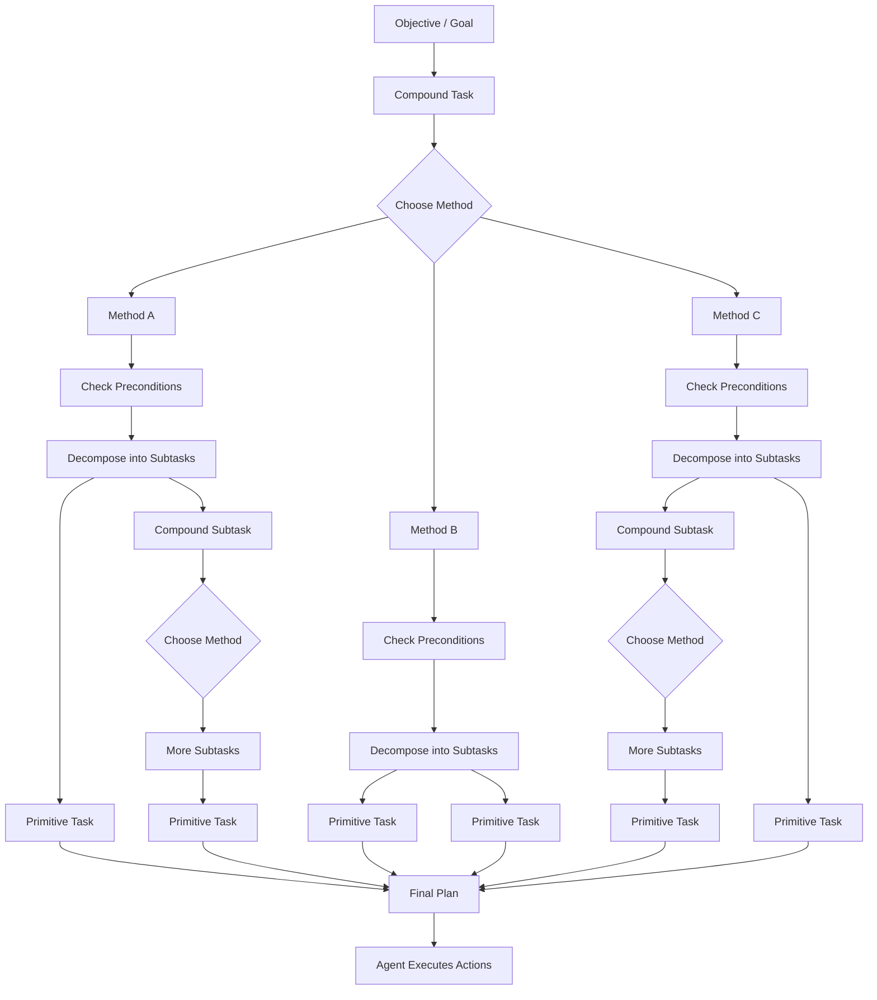
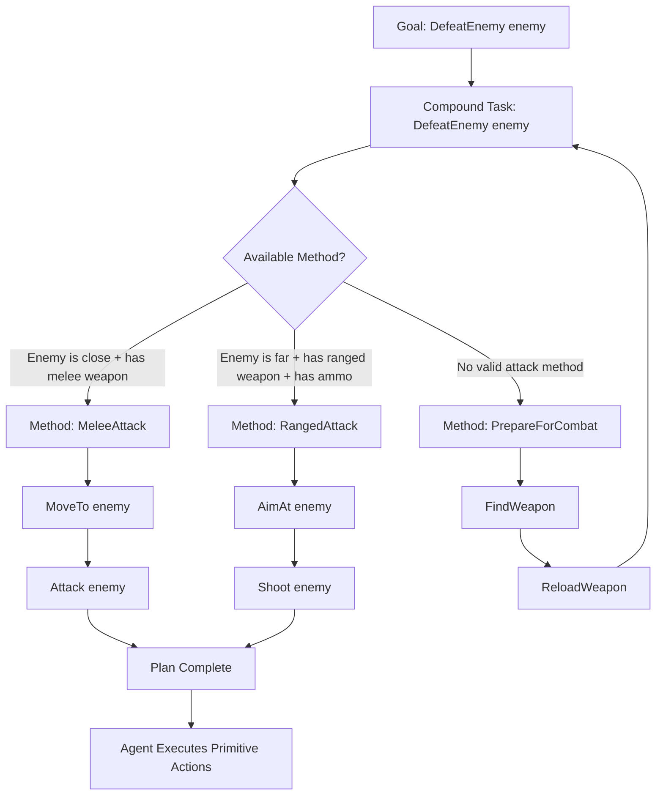

# Hierarchical Task Network - HTN

> Hierarchical Task Network planning is an AI planning technique where abstract goals are broken down into structured
> tasks and eventually into concrete actions that an agent can execute.

## Concepts

### Task

A **task** represents something that the planner must accomplish.

Tasks are usually defined by:

* **Name**
  * Identifier of the task.
  * Example: `AttackEnemy`, `PatrolArea`, `FindWeapon`.

* **Parameters**
  * Values required by the task.
  * Example: `AttackEnemy(enemy)`, `MoveTo(location)`.

* **Constraints / Preconditions**
  * Conditions that must be true for the task to be valid.
  * Example: the enemy must be visible before attacking.

* **Result / Effects**
  * Expected changes after the task is executed.
  * Example: after `ReloadWeapon`, the weapon has ammo.

## Task Types

### Primitive Task

A **primitive task** is an atomic, concrete action that can be executed directly by the agent.

Examples:

```text
MoveTo(position)
ReloadWeapon()
OpenDoor(door)
Attack(enemy)
````

Primitive tasks are usually connected to actual game actions, animation commands, behavior tree nodes, or gameplay systems.

### Compound Task

A **compound task** is an abstract task that cannot be executed directly.

Instead, it must be decomposed into smaller subtasks using a **method**.

Examples:

```text
SurviveNight()
EscapeMansion()
DefeatEnemy(enemy)
FindSafeRoute(destination)
```

A compound task may be decomposed into:

* primitive tasks;
* other compound tasks;
* a sequence of both.

Example:

```text
EscapeMansion()
  -> FindExit()
  -> AvoidEnemies()
  -> MoveTo(exit)
  -> OpenDoor(exit)
```

## HTN Planning Flow


Example version using your `DefeatEnemy(enemy)` idea:


## Method

A **method** defines one possible way to decompose a compound task into subtasks.

Example:

```text
Task: DefeatEnemy(enemy)

Method: MeleeAttack
Preconditions:
  - enemy is close
  - agent has melee weapon

Subtasks:
  - MoveTo(enemy)
  - Attack(enemy)
```

Another method for the same task:

```text
Task: DefeatEnemy(enemy)

Method: RangedAttack
Preconditions:
  - enemy is far
  - agent has ranged weapon
  - weapon has ammo

Subtasks:
  - AimAt(enemy)
  - Shoot(enemy)
```

## Plan

A **plan** is the final sequence of primitive tasks generated after all compound tasks have been decomposed.

Example:

```text
MoveTo(weapon)
PickUp(weapon)
MoveTo(enemy)
Attack(enemy)
EscapeArea()
```

## Summary

| Concept             | Meaning                                                 |
|---------------------|---------------------------------------------------------|
| **Task**            | Something the agent needs to accomplish                 |
| **Primitive Task**  | A concrete action executable by the agent               |
| **Compound Task**   | An abstract task that must be decomposed                |
| **Method**          | A rule that explains how to decompose a compound task   |
| **Plan**            | Final ordered sequence of executable primitive actions  |
