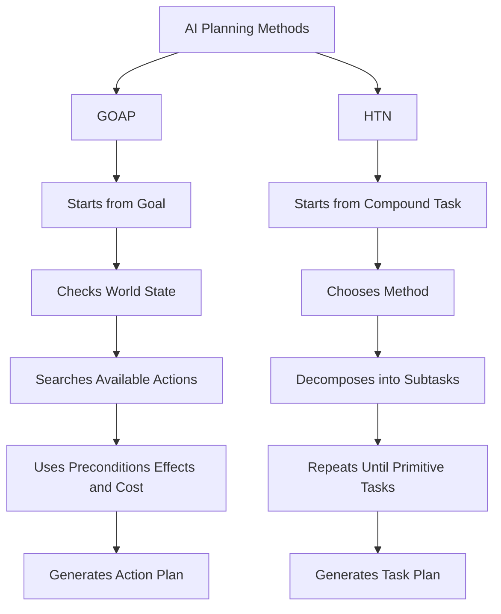

# Planning Methods Comparison

> This page compares two AI planning approaches commonly used in game AI: Goal Oriented Action Planning (GOAP) and
> Hierarchical Task Network (HTN).

## Overview

Both GOAP and HTN are planning techniques used to generate behavior for autonomous agents.

They differ mainly in how the plan is produced.

GOAP searches for a sequence of actions that satisfies a goal.

HTN decomposes high-level tasks into smaller subtasks until executable actions are reached.

## Comparison Table

| Aspect                  | GOAP                                                        | HTN                                                          |
|-------------------------|-------------------------------------------------------------|--------------------------------------------------------------|
| **Main Idea**           | Search for an action sequence that satisfies a goal         | Decompose high-level tasks into smaller tasks                |
| **Starting Point**      | Goal state                                                  | Compound task                                                |
| **Core Structure**      | Goal → Actions → Preconditions → Effects                    | Task → Method → Subtasks                                     |
| **Plan Generation**     | Search-based                                                | Decomposition-based                                          |
| **Designer Control**    | Lower; behavior can be more emergent                        | Higher; behavior structure is more authored                  |
| **Flexibility**         | High flexibility in dynamic environments                    | Flexible, but usually more constrained by authored methods   |
| **Predictability**      | Less predictable because plans emerge from action search    | More predictable because task decomposition is structured    |
| **Best Use Case**       | Reactive agents that need to adapt to changing world states | Structured behaviors, missions, routines, and tactical plans |
| **Output**              | Ordered sequence of actions                                 | Ordered sequence of primitive tasks                          |
| **Common Search Logic** | A*, Dijkstra, forward or backward search                    | Recursive task decomposition                                 |
| **Failure Handling**    | Replan when the current plan becomes invalid                | Try another method or fail the task decomposition            |

## GOAP Summary

GOAP represents the world as a set of states.

An agent has:

* a current world state;
* a selected goal;
* a list of available actions;
* action preconditions;
* action effects;
* action costs.

The planner searches for a valid sequence of actions that transforms the current world state into the desired goal
state.

Example:

```text
Current State:
  hasWeapon = false
  enemyVisible = true
  enemyAlive = true

Goal:
  enemyAlive = false

Generated Plan:
  PickUpWeapon()
  MoveToEnemy()
  AttackEnemy()
```

GOAP is useful when the agent should dynamically discover how to solve a problem.

## HTN Summary

HTN represents behavior as a hierarchy of tasks.

An agent starts with a high-level compound task.

The planner chooses methods that decompose that task into smaller subtasks.

This continues until the planner reaches primitive tasks that can be executed directly.

Example:

```text
Compound Task:
  DefeatEnemy(enemy)

Method:
  MeleeAttack

Subtasks:
  MoveTo(enemy)
  Attack(enemy)
```

HTN is useful when the designer wants stronger control over the structure of behavior.

## Conceptual Difference

GOAP asks:

```text
What sequence of actions can satisfy this goal?
```

HTN asks:

```text
How can this high-level task be decomposed into executable steps?
```

## Mermaid Diagram



## When to Use GOAP

Use GOAP when:

* the agent needs high reactivity;
* the world state changes often;
* multiple action combinations can solve the same goal;
* emergent behavior is desirable;
* action cost should influence decision-making.

Examples:

```text
Enemy deciding whether to attack, flee, reload, heal, or search for cover.
NPC choosing how to satisfy hunger, danger, or exploration needs.
AI agent adapting after the player blocks a path or removes an item.
```

## When to Use HTN

Use HTN when:

* behavior needs a clear authored structure;
* the task has known high-level steps;
* designer control is important;
* the agent needs tactical or procedural behavior;
* plans should be easier to debug and reason about.

Examples:

```text
Guard executing a patrol routine.
NPC performing a daily schedule.
Enemy squad executing a tactical assault.
Quest system decomposing a mission into steps.
```

## Summary

| Question                                                     | Better Fit |
|--------------------------------------------------------------|------------|
| Do I want the agent to search dynamically for a solution?    | GOAP       |
| Do I want the agent to follow structured task decomposition? | HTN        |
| Do I need more emergent behavior?                            | GOAP       |
| Do I need more predictable behavior?                         | HTN        |
| Do I want stronger designer control?                         | HTN        |
| Do I want action costs to drive planning?                    | GOAP       |

GOAP is more search-driven.

HTN is more structure-driven.

Both can be combined in advanced AI systems.
