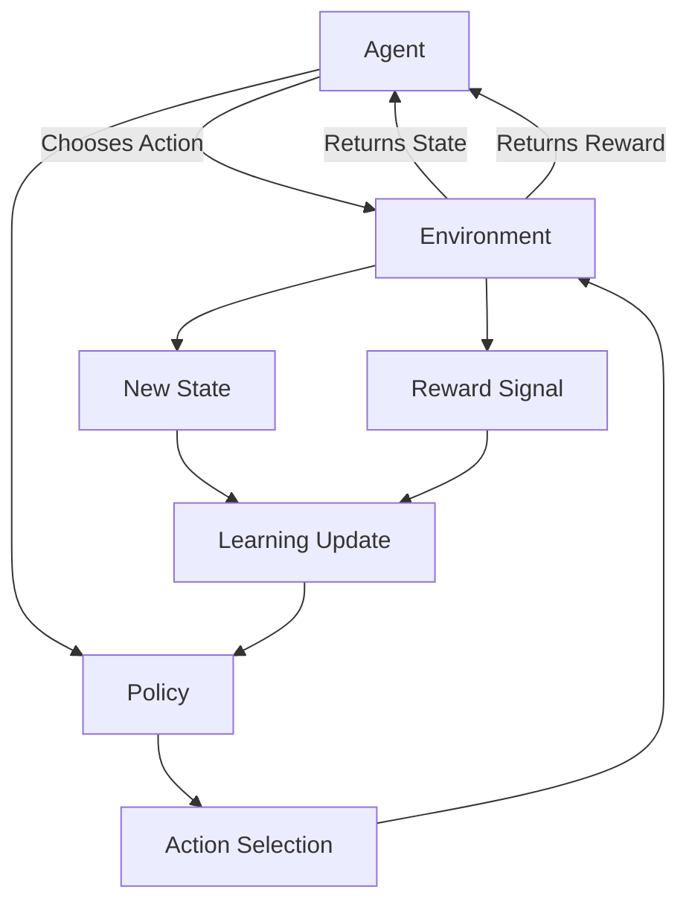
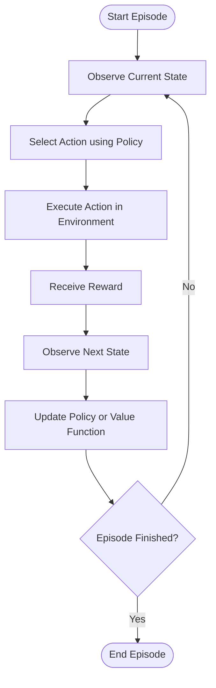
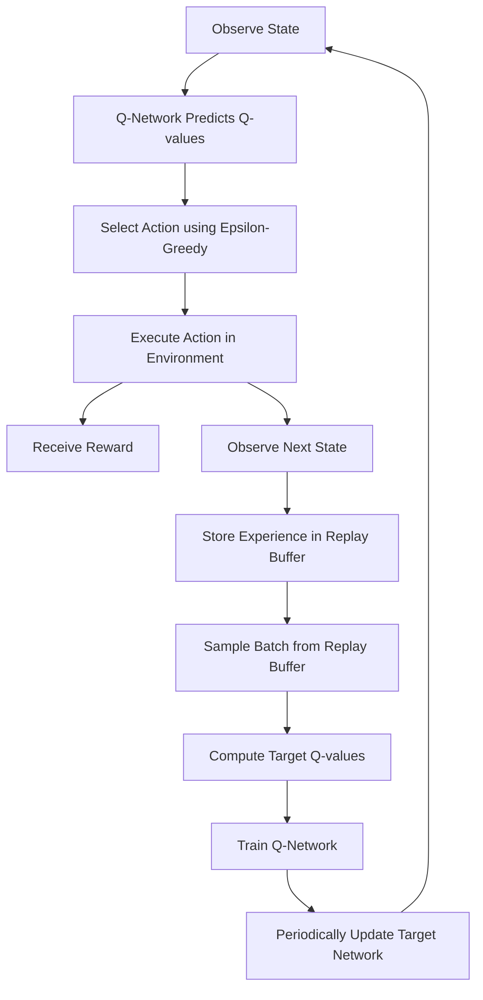
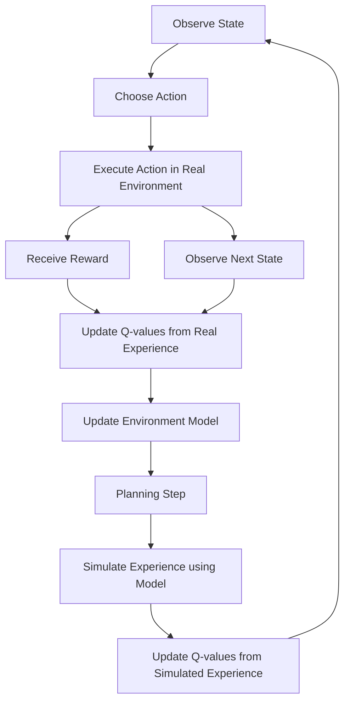

# Reinforcement Learning - RL

> Reinforcement Learning is a machine learning approach where an agent learns how to act by interacting with an
> environment, receiving rewards or penalties, and improving its behavior over time.

## Overview

Reinforcement Learning is based on trial and error.

The agent observes the current state of the environment, chooses an action, receives feedback through a reward, and
updates its behavior to maximize future rewards.

Instead of being directly told what to do, the agent learns from the consequences of its actions.

Example:

```text
Agent:
  Enemy NPC

Environment:
  Game level

State:
  Player distance, enemy health, ammo count, cover availability

Action:
  Attack, flee, reload, search cover

Reward:
  +10 for damaging the player
  +50 for surviving
  -20 for taking damage
  -100 for dying
```

## Structures

| Structure          | Meaning                                                    |
|--------------------|------------------------------------------------------------|
| **Agent**          | The entity that learns and makes decisions                 |
| **Environment**    | The world where the agent acts                             |
| **State**          | The current situation observed by the agent                |
| **Action**         | A choice available to the agent                            |
| **Reward**         | Feedback received after performing an action               |
| **Policy**         | Strategy used by the agent to choose actions               |
| **Value Function** | Estimate of how good a state is                            |
| **Q-Function**     | Estimate of how good an action is in a state               |
| **Episode**        | One complete training run or interaction sequence          |
| **Epsilon**        | Probability of choosing a random action during exploration |
| **Model**          | Approximation of how the environment behaves               |
| **Replay Buffer**  | Memory of past experiences used for training               |
| **Target Network** | Stabilized neural network used in Deep Q-Learning          |

## Concepts

### Agent

The **agent** is the decision-maker.

In games, an agent can be:

* an enemy NPC;
* a companion character;
* a racing car;
* a strategy game unit;
* a procedural behavior controller.

Example:

```text
Agent:
  Guard NPC
```

The agent receives information from the environment and chooses actions based on its current policy.

---

### Environment

The **environment** is the world where the agent operates.

It provides:

* the current state;
* the result of actions;
* rewards;
* termination conditions.

Example:

```text
Environment:
  Mansion level with rooms, enemies, items, doors, and hazards
```

The environment changes when the agent performs actions.

---

### State

A **state** represents the current situation of the agent and the environment.

In games, a state may include:

```text
playerVisible = true
playerDistance = 8.5
agentHealth = 40
hasAmmo = true
nearCover = false
enemyAlerted = true
```

The quality of the state representation strongly affects learning.

A bad state representation may prevent the agent from learning useful behavior.

---

### Action

An **action** is something the agent can do.

Examples:

```text
MoveToPlayer()
Attack()
Reload()
TakeCover()
Flee()
Patrol()
```

Actions can be:

* **discrete**
  * fixed set of possible actions;
  * example: `Attack`, `Defend`, `Reload`.

* **continuous**
  * values inside a range;
  * example: movement direction, steering angle, acceleration.

---

### Reward

A **reward** is feedback given to the agent after it performs an action.

The reward tells the agent whether the action was useful or harmful.

Example:

```text
+10  damage player
+25  survive encounter
+50  defeat player
-10  miss attack
-25  take damage
-100 die
```

The agent learns by trying to maximize cumulative reward over time.

Reward design is one of the most important parts of Reinforcement Learning.

Bad rewards can create bad behavior.

Example:

```text
Reward:
  +1 for moving

Possible Problem:
  The agent may learn to move forever without completing the objective.
```

---

### Policy

A **policy** defines how the agent chooses actions.

It maps states to actions.

Example:

```text
State:
  low health
  enemy visible
  near cover

Policy chooses:
  TakeCover()
```

A policy can be:

* random;
* rule-based;
* learned through training;
* represented by a neural network.

The goal of training is to improve the policy.

---

### Value Function

A **value function** estimates how good a state is.

It answers:

```text
How valuable is this state for future success?
```

Example:

```text
State:
  agent has weapon
  agent has ammo
  player visible
  agent health is high

Value:
  High
```

A state with better long-term reward has a higher value.

---

### Q-Function

A **Q-function** estimates how good it is to perform a specific action in a specific state.

It answers:

```text
How good is this action in this state?
```

Example:

```text
State:
  player visible
  agent has ammo
  player is far away

Action:
  ShootPlayer()

Q-value:
  8.5
```

Another action in the same state may have a different value:

```text
Action:
  MeleeAttack()

Q-value:
  1.2
```

The agent should prefer actions with higher expected value.

---

### Episode

An **episode** is one complete sequence of interaction between the agent and the environment.

Example:

```text
Episode Start:
  Enemy spawns

Episode Steps:
  Enemy patrols
  Enemy sees player
  Enemy attacks
  Enemy takes damage
  Enemy flees
  Enemy survives

Episode End:
  Enemy dies or combat ends
```

At the end of each episode, the agent can use the collected experience to improve its policy.

---

## Reinforcement Learning Loop

The basic RL loop is:

```text
Observe state
Choose action
Execute action
Receive reward
Observe next state
Update policy
Repeat
```

## Diagram



## Training Flow



---

# Exploration and Exploitation

Reinforcement Learning requires a balance between **exploration** and **exploitation**.

## Exploration

The agent tries new actions to discover better strategies.

Example:

```text
The agent tries taking cover instead of attacking immediately.
```

## Exploitation

The agent uses the best strategy it already knows.

Example:

```text
The agent attacks because it has learned that attacking gives high reward in this situation.
```

Too much exploration can make the agent behave randomly.

Too much exploitation can prevent the agent from discovering better strategies.

---

# Epsilon-Greedy Strategy

**Epsilon-greedy** is a common strategy used to balance exploration and exploitation.

The agent chooses between:

* a random action;
* the best-known action.

The probability of choosing a random action is controlled by **epsilon**.

```text
epsilon = 1.0
  Agent explores a lot.

epsilon = 0.1
  Agent mostly exploits the best-known action.

epsilon = 0.0
  Agent always exploits.
```

## Epsilon-Greedy Rule

```text
If random value < epsilon:
  Choose random action

Else:
  Choose action with highest Q-value
```

Example:

```text
State:
  enemyVisible = true
  hasAmmo = true

Available Actions:
  ShootEnemy   Q-value: 8.5
  Reload       Q-value: 2.0
  TakeCover    Q-value: 4.0
```

If the agent is exploiting, it chooses:

```text
ShootEnemy
```

If the agent is exploring, it may choose:

```text
Reload
TakeCover
ShootEnemy
```

## Epsilon Decay

Usually epsilon starts high and decreases over time.

```text
Training Start:
  epsilon = 1.0

Middle Training:
  epsilon = 0.3

Late Training:
  epsilon = 0.05
```

This means the agent explores a lot at the beginning and gradually relies more on what it has learned.

Example:

```text
epsilon = max(min_epsilon, epsilon * decay_rate)
```

---

# Q-Learning

**Q-Learning** is a model-free Reinforcement Learning algorithm.

It learns the value of taking an action in a state.

The agent stores values in a Q-table.

```text
Q[state, action] = expected future reward
```

Example:

| State                                  | Action       | Q-value |
|----------------------------------------|--------------|---------|
| `enemyVisible = true, hasAmmo = true`  | `ShootEnemy` | `8.5`   |
| `enemyVisible = true, hasAmmo = true`  | `TakeCover`  | `4.0`   |
| `enemyVisible = true, hasAmmo = false` | `Reload`     | `7.0`   |

The agent uses these values to choose better actions over time.

## Q-Learning Update

The Q-value is updated after the agent performs an action.

```text
New Q-value =
  Old Q-value
  + learning rate * difference between expected and observed reward
```

Conceptually:

```text
Q(state, action) should move closer to:
  reward + future expected reward
```

## Q-Learning Example

```text
Current State:
  hasAmmo = true
  enemyVisible = true

Action:
  ShootEnemy

Reward:
  +10

Next State:
  enemyDamaged = true
```

The agent updates the Q-value for:

```text
Q(hasAmmo = true, enemyVisible = true, ShootEnemy)
```

If shooting produced a good result, the value of shooting in that state increases.

---

# Deep Q-Learning - DQL / DQN

**Deep Q-Learning** extends Q-Learning by replacing the Q-table with a neural network.

It is also commonly known as **Deep Q-Network**, or **DQN**.

Instead of storing every state-action pair in a table, the neural network approximates Q-values.

This is useful when the state space is too large for a table.

Example:

```text
Input:
  playerDistance
  agentHealth
  ammoCount
  coverDistance
  playerVisible

Output:
  Q-value for Attack
  Q-value for Reload
  Q-value for TakeCover
  Q-value for Flee
```

The action with the highest Q-value is usually selected during exploitation.

## Why Deep Q-Learning Is Useful

A Q-table works for small problems.

Example:

```text
Small grid world
Few actions
Limited number of states
```

But games often have large or continuous state spaces.

Example:

```text
Player position
Enemy position
Health
Ammo
Distances
Visibility
Cooldowns
Cover positions
```

In these cases, a neural network can generalize from previous experience.

---

## Experience Replay

**Experience replay** stores past experiences in a replay buffer.

Each experience usually contains:

```text
state
action
reward
next_state
done
```

Example:

```text
Experience:
  state:
    health = 40
    hasAmmo = true
    enemyVisible = true

  action:
    Attack

  reward:
    +10

  next_state:
    health = 40
    enemyDamaged = true

  done:
    false
```

During training, the agent samples random experiences from the replay buffer.

This helps stabilize learning because the neural network does not only learn from the most recent event.

---

## Target Network

A **target network** is a delayed copy of the main Q-network.

Deep Q-Learning uses it to make training more stable.

Without a target network, the model may chase a moving target too aggressively.

Basic idea:

```text
Main Network:
  Updated every training step.

Target Network:
  Updated less frequently.
```

Example:

```text
Every 1000 training steps:
  Copy weights from main network to target network.
```

The target network provides more stable Q-value targets during training.

---

## Deep Q-Learning Flow



---

# Model-Free and Model-Based Reinforcement Learning

Reinforcement Learning methods can be divided into:

* **model-free methods**;
* **model-based methods**.

## Model-Free RL

In **model-free RL**, the agent learns what actions are good without learning a model of the environment.

It does not explicitly predict what the next state will be.

Examples:

```text
Q-Learning
SARSA
DQN
PPO
```

Model-free RL answers:

```text
What action should I take in this state?
```

## Model-Based RL

In **model-based RL**, the agent learns or uses a model of the environment.

The model predicts:

```text
If I take this action in this state, what next state and reward should happen?
```

Model-based RL answers:

```text
What will happen if I take this action?
```

A model can be:

* manually designed;
* learned from experience;
* simulated by the game environment.

---

# Dyna-Q

**Dyna-Q** is a Reinforcement Learning architecture that combines direct learning from real experience with planning
using a learned model.

It mixes:

* Q-Learning;
* model learning;
* simulated experience.

The agent learns from real interactions, but also uses its internal model to simulate additional training steps.

## Dyna-Q Core Idea

After the agent performs a real action, it updates:

```text
Q-values
Environment model
```

Then it performs planning steps using simulated experiences generated by the model.

```text
Real experience:
  state -> action -> reward -> next state

Model stores:
  state + action -> predicted reward + predicted next state

Planning:
  sample previous state-action pair
  use model to simulate result
  update Q-values again
```

## Dyna-Q Flow



## Dyna-Q Example

### Real Experience

```text
State:
  enemyVisible = true
  hasAmmo = true

Action:
  ShootEnemy

Reward:
  +10

Next State:
  enemyDamaged = true
```

The agent updates the Q-value for shooting the enemy.

It also stores a model:

```text
Model:
  enemyVisible = true, hasAmmo = true, ShootEnemy
    -> reward = +10
    -> next state = enemyDamaged = true
```

### Simulated Planning

Later, the agent can use the model to simulate:

```text
If I am in this state and shoot the enemy,
I expect reward +10 and enemyDamaged = true.
```

Then it can update the Q-value again without needing another real interaction.

## Why Dyna-Q Is Useful

Dyna-Q can learn faster because it uses both:

* real experience;
* simulated experience.

This is useful when real environment interaction is expensive.

Example in games:

```text
A combat agent trains from real encounters,
but also improves using simulated transitions from past combat situations.
```

---

# Example: Enemy Combat Agent

## Objective

Train an enemy NPC to survive combat and damage the player.

## State

```text
playerVisible = true
playerDistance = 12
agentHealth = 35
hasAmmo = true
nearCover = true
```

## Actions

```text
AttackPlayer()
MoveToCover()
ReloadWeapon()
Flee()
ChasePlayer()
```

## Rewards

```text
+10  player damaged
+20  agent reaches cover while low health
+30  agent survives combat
-10  missed attack
-20  agent takes damage
-100 agent dies
```

## Possible Learned Behavior

```text
If health is high and player is visible:
  AttackPlayer()

If health is low and cover is nearby:
  MoveToCover()

If ammo is empty:
  ReloadWeapon()

If player is far away:
  ChasePlayer()
```

The agent is not explicitly programmed with these rules.

It learns them by interacting with the environment and maximizing reward.

---

# Common Algorithms

| Algorithm                 | Description                                                                  |
|---------------------------|------------------------------------------------------------------------------|
| **Q-Learning**            | Learns action values for state-action pairs                                  |
| **SARSA**                 | Similar to Q-Learning, but updates based on the action actually taken        |
| **Deep Q-Learning / DQN** | Uses a neural network to approximate Q-values                                |
| **Dyna-Q**                | Combines Q-Learning with model-based simulated planning                      |
| **Policy Gradient**       | Directly learns a policy instead of only value estimates                     |
| **Actor-Critic**          | Combines policy learning and value estimation                                |
| **PPO**                   | Stable policy optimization algorithm commonly used in game-like environments |

---

# Use Cases in Games

Reinforcement Learning can be used for:

* enemy combat behavior;
* racing AI;
* procedural animation control;
* balancing game systems;
* adaptive difficulty;
* NPC strategy learning;
* multi-agent simulations;
* automated playtesting.

Example:

```text
A racing AI learns how to complete a track by receiving positive rewards for progress and negative rewards for
collisions.
```

---

# Challenges

| Challenge                | Meaning                                                            |
|--------------------------|--------------------------------------------------------------------|
| **Reward Design**        | Bad rewards can produce unwanted behavior                          |
| **Training Time**        | Agents may need many simulations to learn                          |
| **State Representation** | Poor state design can make learning ineffective                    |
| **Exploration Problem**  | The agent may fail to discover useful strategies                   |
| **Unstable Behavior**    | Learned behavior may be hard to predict                            |
| **Debugging Difficulty** | It can be hard to understand why the agent made a decision         |
| **Sample Efficiency**    | Some methods require many interactions to learn useful behavior    |
| **Generalization**       | The agent may perform poorly in situations different from training |

---

# Summary

| Concept             | Meaning                                             |
|---------------------|-----------------------------------------------------|
| **Agent**           | Entity that learns and makes decisions              |
| **Environment**     | World where the agent acts                          |
| **State**           | Current situation observed by the agent             |
| **Action**          | Choice available to the agent                       |
| **Reward**          | Feedback signal after an action                     |
| **Policy**          | Strategy for choosing actions                       |
| **Value Function**  | Estimate of how good a state is                     |
| **Q-Function**      | Estimate of how good an action is in a state        |
| **Episode**         | Complete interaction sequence                       |
| **Training**        | Process of improving the policy through experience  |
| **Exploration**     | Trying new actions                                  |
| **Exploitation**    | Using known good actions                            |
| **Epsilon**         | Probability of taking a random exploratory action   |
| **Q-Learning**      | Learns action values from experience                |
| **Deep Q-Learning** | Uses neural networks to approximate Q-values        |
| **Dyna-Q**          | Combines real learning with simulated planning      |
| **Replay Buffer**   | Stores past experiences for training                |
| **Target Network**  | Stabilizes Deep Q-Learning updates                  |
