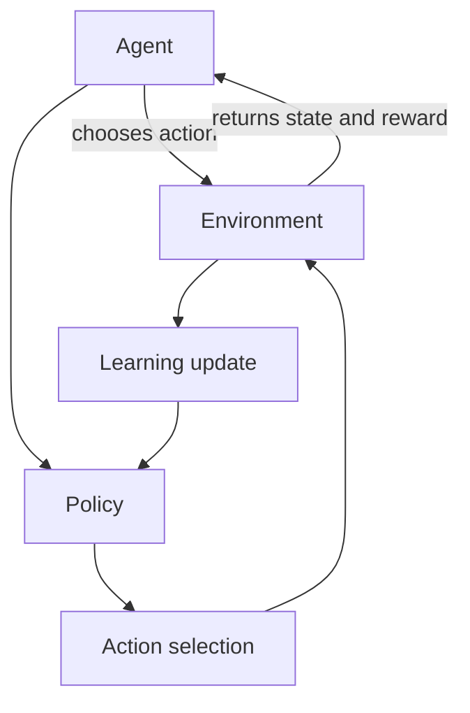

# Reinforcement Learning basics

> Reinforcement Learning (RL) is a machine-learning approach in which an agent learns how to act by interacting with an environment, receiving rewards or penalties, and improving over time.

RL is based on trial and error. The agent observes the environment, chooses an action, receives a reward, observes the resulting state, and updates its behavior to maximize future rewards.

## Core structures

| Structure          | Meaning                                            |
|--------------------|----------------------------------------------------|
| **Agent**          | The entity that learns and makes decisions.        |
| **Environment**    | The world in which the agent acts.                 |
| **State**          | The current situation observed by the agent.       |
| **Action**         | A choice available to the agent.                   |
| **Reward**         | Feedback received after performing an action.      |
| **Policy**         | The strategy used to select actions.               |
| **Value function** | An estimate of how good a state is.                |
| **Q-function**     | An estimate of how good an action is in a state.   |
| **Episode**        | One complete training run or interaction sequence. |

For an enemy NPC, a state might include player distance, agent health, ammunition, and cover availability. Its actions might be `Attack`, `Flee`, `Reload`, or `TakeCover`.

## Core concepts

### Agent and environment

The **agent** is the decision-maker: for example, an enemy NPC, a racing car, or a strategy-game unit. The **environment** provides the current state, action outcomes, rewards, and termination conditions.

### State and action

A **state** describes the current situation. In a game, it might be:

```text
playerVisible = true
playerDistance = 8.5
agentHealth = 40
hasAmmo = true
nearCover = false
```

An **action** is something the agent can do. Actions can be discrete, such as `Attack` and `Reload`, or continuous, such as steering angle or acceleration. A useful state representation is essential: incomplete or irrelevant information can prevent learning useful behavior.

### Reward

A **reward** indicates whether an action was useful or harmful. The agent aims to maximize cumulative reward over time.

```text
+10   damage the player
+50   survive an encounter
-20   take damage
-100  die
```

Reward design is critical. For example, rewarding only movement can teach an agent to move indefinitely rather than complete an objective.

### Policy, value, and Q-value

A **policy** maps states to actions. It may be random, rule-based, learned, or represented by a neural network.

A **value function** estimates the long-term desirability of a state. A **Q-function** estimates the desirability of taking a particular action in a particular state:

```text
Q(state, action) = expected future reward
```

The agent generally prefers actions with higher expected Q-values.

### Episode

An **episode** is a complete sequence of interaction, such as an enemy spawning, patrolling, fighting, and then either dying or ending combat. Collected experience can be used to improve the policy after or during the episode.

## The RL loop

```text
Observe state
Choose action
Execute action
Receive reward
Observe next state
Update policy or value function
Repeat
```



## Exploration and exploitation

**Exploration** tries new actions to discover better strategies. **Exploitation** uses the best strategy currently known. An agent needs both: excessive exploration looks random, while excessive exploitation can prevent the discovery of better behavior.

### Epsilon-greedy

Epsilon-greedy is a common balance strategy. With probability **epsilon**, the agent chooses a random action; otherwise, it chooses the action with the highest known Q-value.

```text
if random value < epsilon:
    choose a random action
else:
    choose the action with the highest Q-value
```

Epsilon commonly starts high and decays during training:

```text
epsilon = max(min_epsilon, epsilon * decay_rate)
```

## Practical concerns

| Challenge            | Why it matters                                                   |
|----------------------|------------------------------------------------------------------|
| Reward design        | Poor rewards can create undesirable behavior.                    |
| Training time        | Agents may need many simulations.                                |
| State representation | Poor state design can make learning ineffective.                 |
| Exploration          | The agent may not discover useful strategies.                    |
| Generalization       | Learned behavior may perform poorly outside training situations. |

Continue with [model-free RL](model-free.md), [model-based RL](model-based.md), [multi-objective RL](morl.md), or [RL with Options](rl-with-options.md).

## Further reading

Sutton and Barto's [*Reinforcement Learning: An Introduction*](../../reference/bibliography.md) is the foundational reference for the MDP formulation, value functions, temporal-difference learning, and policy-based methods used throughout these notes.
