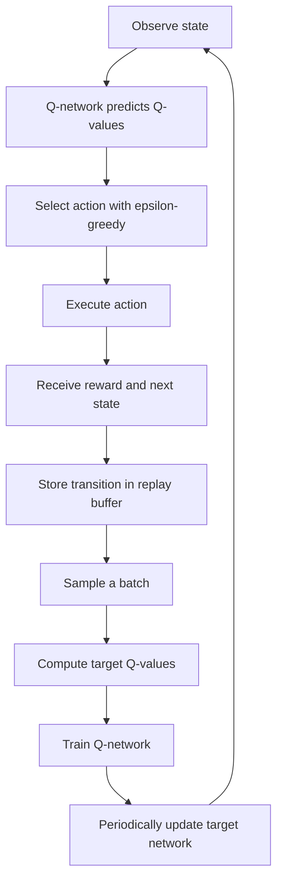

# Model-free Reinforcement Learning

In **model-free RL**, the agent learns which actions are good without learning an explicit model of environment dynamics. It does not directly predict the next state or reward before acting.

Model-free RL answers:

```text
What action should I take in this state?
```

Common examples include Q-Learning, SARSA, DQN, PPO, and actor-critic methods.

## Q-Learning

**Q-Learning** learns the value of taking an action in a state. For small, discrete problems, it stores values in a Q-table:

```text
Q[state, action] = expected future reward
```

| State                                  | Action       | Q-value |
|----------------------------------------|--------------|--------:|
| `enemyVisible = true, hasAmmo = true`  | `ShootEnemy` |     8.5 |
| `enemyVisible = true, hasAmmo = true`  | `TakeCover`  |     4.0 |
| `enemyVisible = true, hasAmmo = false` | `Reload`     |     7.0 |

After an action, the Q-value moves toward the observed reward plus the estimated future reward:

```text
new Q-value = old Q-value + learning rate * (target - old Q-value)
target = reward + future expected reward
```

For example, if `ShootEnemy` yields a positive reward from a state where the agent has ammunition and sees the enemy, the Q-value for that state-action pair increases.

## Deep Q-Learning (DQN)

**Deep Q-Learning** replaces the Q-table with a neural network that approximates Q-values. It is useful when the state space is too large or continuous for a table.

```text
Input:  player distance, agent health, ammunition, cover distance, visibility
Output: Q-values for attack, reload, take cover, and flee
```

During exploitation, the agent generally selects the action with the largest predicted Q-value.

### Experience replay

Experience replay stores transitions in a replay buffer:

```text
state
action
reward
next_state
done
```

Training samples random batches from this buffer instead of learning only from the most recent event. This reduces correlations between consecutive experiences and tends to make optimization more stable.

### Target network

A target network is a delayed copy of the main Q-network. The main network changes every training step, while the target network updates less frequently. This stabilizes the Q-value targets used for learning.



## Related algorithms

| Algorithm           | Description                                                       |
|---------------------|-------------------------------------------------------------------|
| **SARSA**           | Updates values using the action actually selected next.           |
| **Policy gradient** | Directly optimizes a policy rather than only value estimates.     |
| **Actor-critic**    | Combines policy learning with value estimation.                   |
| **PPO**             | A stable policy-optimization method widely used in control tasks. |

For the underlying terms and exploration strategy, see [RL basics](basics.md). For approaches that learn or use transition dynamics, see [model-based RL](model-based.md).
