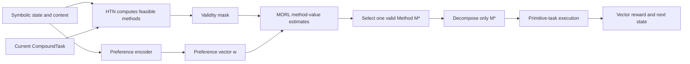

# Multi-Objective Reinforcement Learning (MORL)

Multi-Objective Reinforcement Learning extends RL to decisions with several objectives that can conflict. Rather than returning one scalar reward, the environment returns a vector:

$$
\mathbf{r}_t = [r_t^{\mathrm{mission}}, r_t^{\mathrm{safety}}, r_t^{\mathrm{resources}}, r_t^{\mathrm{time}}]
$$

Here, $t$ is the primitive environment time step; $\mathbf{r}_t$ is the reward vector observed at that step; and each superscript identifies one objective component. The components are examples and may be replaced by the objectives defined for an experiment.

For example, a game agent may want to complete a mission, avoid damage, conserve ammunition, and minimize time. A single scalar reward can conceal which trade-off produced a decision. MORL keeps these components separate and makes the trade-off explicit. See [Hayes et al.](../../reference/bibliography.md) for the practical implications of preference specification and [Felten et al.](../../reference/bibliography.md) for the relationship between MORL and multi-objective decomposition.

## Core concepts

| Term                                   | Meaning in this project                                                  |
|----------------------------------------|--------------------------------------------------------------------------|
| Vector reward $\mathbf{r}_t$           | Per-objective feedback after execution.                                  |
| Vector return $\mathbf{G}_t$           | Discounted accumulation of vector rewards.                               |
| Preference vector $\mathbf{w}$         | Relative importance of objectives for the current decision.              |
| Utility $u_{\mathbf{w}}(\mathbf{G}_t)$ | A scalar comparison induced by a preference model.                       |
| Pareto trade-off                       | A solution for which improving one objective requires worsening another. |
| Coverage set                           | Policies or method-selection behaviors useful for different preferences. |

When linear scalarization is appropriate, a preference vector can be used as:

$$
u_{\mathbf{w}}(\mathbf{G}_t) = \mathbf{w}^{\mathsf{T}}\mathbf{G}_t
$$

In this equation, $\mathbf{G}_t$ is the vector return from time $t$, $\mathbf{w}$ is a non-negative preference vector, $\mathbf{w}^{\mathsf{T}}$ is its transpose, and $u_{\mathbf{w}}$ maps the vector return to a scalar utility. For normalized linear preferences, $\sum_{j=1}^{k}w_j = 1$, where $k$ is the number of objectives.

This is useful for controlled experiments, but it is an assumption rather than a universal law. Some preferences are non-linear, constrained, or lexicographic. A safety constraint, for example, should normally remain a symbolic hard constraint instead of becoming a weight that can be traded away.

## MORL for HTN method selection

The proposed architecture applies MORL at one precise point: a `CompoundTask` has more than one applicable `Method` during planning. The HTN planner first computes:

$$
\mathcal{M}_{\mathrm{valid}}(s_t, \tau_t) = \left\{m \in \mathcal{M}(\tau_t) \mid \operatorname{preconditions}(m, s_t)\right\}
$$

Here, $s_t$ is the current symbolic state, $\tau_t$ is the current compound task, $\mathcal{M}(\tau_t)$ is the set of methods declared for that task, $m$ is one candidate method, and $\mathcal{M}_{\mathrm{valid}}$ is the subset whose preconditions hold in $s_t$.

Only then does MORL make one direct selection. A conceptual decision rule is:

$$
m^* = \underset{m \in \mathcal{M}_{\mathrm{valid}}(s_t, \tau_t)}{\operatorname{arg\,max}}\; u_{\mathbf{w}}\!\left(\mathbf{Q}(s_t, \tau_t, m)\right)
$$

In this equation, $m^*$ is the selected method, $\mathbf{Q}(s_t, \tau_t, m)$ is the estimated vector value of choosing $m$ in state $s_t$ for task $\tau_t$, and $\operatorname{arg\,max}$ returns the candidate with the highest utility under $\mathbf{w}$.

`Q` is a vector-valued estimate of the consequence of choosing method `m`, not an authorization to execute an arbitrary primitive action. The planner's feasible-method mask is authoritative: MORL cannot select a method excluded by symbolic preconditions. The online path does not expand or compare partial plans for every candidate: one masked inference selects $m^*$, and HTN decomposes only $m^*$.

This separation preserves two different guarantees:

- **HTN validity:** the selected method satisfies the domain's hard symbolic conditions.
- **MORL adaptation:** among valid methods, the choice reflects the current objective trade-off.

## Failure recovery and replanning

Selection, decomposition failure, and runtime change are distinct events. A method whose preconditions fail is removed by the HTN mask and never reaches MORL. A method that is locally valid may still fail while its subtasks are decomposed; only then does the planner use **method fallback**: it masks the failed method and asks MORL to select again from the remaining methods. If the state and preferences are unchanged, the original method values can be reused and only a new masked `argmax` is needed.

By contrast, a world change during primitive execution does not search backward through a stale symbolic state. The agent senses the current state and replans from that state. Thus, fallback is local recovery during decomposition, while replanning responds to runtime invalidation.

## Preferences and context change

The preference vector $\mathbf{w}_t$ describes what matters now. It may change because an ally becomes vulnerable, resources become scarce, or a game-design profile changes. This differs from changing environment dynamics: preferences can change even when transition dynamics are stationary.

Preference generation is deliberately separate from MORL method selection. Fixed profiles and explicit rules are interpretable baselines. A relational graph encoder or deep-learning encoder may infer $\mathbf{w}_t$ from state and context, but it must use the same HTN mask and MORL interface as every other encoder. See [preference-weight generation](../../architecture/preference-weight-generation.md).

## Learning transition and credit assignment

Method selection is temporally extended. A transition starts when MORL selects a valid method and ends at the next method-selection point, decomposition completion, replanning, or episode termination. The method-level reward is the discounted accumulation of primitive-step rewards during that interval:

$$
\mathbf{R}_{\mathrm{method}} = \sum_{i=0}^{k-1}\gamma^i\mathbf{r}_{t+i}
$$

Here, $\mathbf{R}_{\mathrm{method}}$ is the vector return assigned to one method-selection decision, $i$ indexes primitive steps after selection, $k$ is the number of executed primitive steps before control returns, and $\gamma \in [0,1]$ is the discount factor.

This is a semi-MDP-style transition. It avoids assigning all credit to one primitive action when the learned decision was instead a hierarchical decomposition choice. The same temporal boundary connects the design to [RL with Options](rl-with-options.md).

## Experimental questions

The evaluation should distinguish four effects that are otherwise easy to conflate:

| Comparison                                               | Isolates                                             |
|----------------------------------------------------------|------------------------------------------------------|
| Fixed HTN order vs. MORL with fixed $\mathbf{w}$         | Learned direct selection among valid methods.        |
| Fixed $\mathbf{w}$ vs. dynamic rule-based $\mathbf{w}_t$ | Adaptation to changing preferences.                  |
| Rules vs. graph/deep encoder                             | Value of structured or learned preference inference. |
| MORL with and without HTN mask in a safe test setting    | Value of symbolic validity filtering.                |

Useful metrics include vector return, utility under held-out preferences, task success, invalid-method selection rate, decomposition-fallback rate, adaptation latency, method-switch stability, and normal-path planning-time latency. The full integration proposal is described in [the symbolic MORL architecture](../../architecture/symbolic-morl.md).

## Current project status

The repository currently provides the HTN baseline, including ordered methods, backtracking, sensors, and replanning. MORL method values, the external feasible-method selector, multi-objective rewards, and preference encoders are proposed work rather than implemented runtime behavior.

For general RL terms, see [RL basics](basics.md). For reuse across preferences and efficient policy improvement, see the references to GPI and MORL in the [bibliography](../../reference/bibliography.md).
