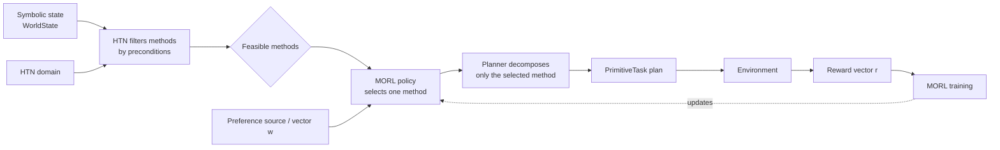
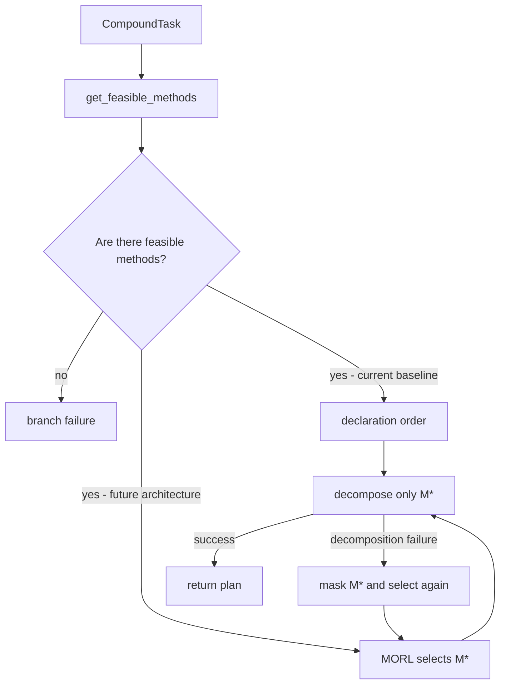

# Proposed architecture: MORL-guided HTN method selection

!!! warning "Research proposal — not implemented yet"
    This page describes the revised research architecture. The current code implements the HTN baseline with depth-first search, ordered methods, and backtracking. MORL method selection and preference encoders are not yet part of the runtime.

## Problem addressed by the architecture

In the baseline, the `Planner` filters methods by preconditions and tries feasible ones in declaration order. When a decomposition fails, it backtracks and tries the next one. This procedure produces the first valid plan, but does not distinguish equally applicable methods by strategic quality, cost, risk, or other objectives.

The proposal preserves HTN symbolic guarantees and adds a learned decision **only** among methods that are already applicable. Learning therefore prioritizes valid alternatives rather than replacing precondition checks or allowing actions outside the domain.

## Target architecture

### Layer responsibilities

| Layer              | Responsibility                                                                   |
|--------------------|----------------------------------------------------------------------------------|
| HTN                | Defines tasks, methods, preconditions, effects, and the decomposition structure. |
| Symbolic filter    | Eliminates methods whose preconditions are not satisfied in `WorldState`.        |
| MORL               | Selects one remaining method according to multiple objectives and preferences.   |
| Executor           | Executes primitive tasks and observes results in the environment.                |
| Training           | Learns method values from vector rewards.                                        |
| Preference source  | Supplies `𝐰` from a profile, game director, rule, or optional learned encoder.   |

## MORL at the planning-time decision point

In Multi-Objective Reinforcement Learning, the reward is no longer a scalar and becomes a vector:

$$
\mathbf{r} = [r_1, r_2, \ldots, r_d]\in\mathbb{R}^d
$$

Each component represents an objective, such as progress toward the goal, resource consumption, safety, or time. Under linear scalarization, a preference-conditioned policy can represent different supported trade-offs across the preference simplex. The corresponding solution concept is related to a convex coverage set; arbitrary non-convex Pareto-optimal trade-offs may require non-linear utilities or another MORL solution concept.

A preference vector is written as:

$$
\mathbf{w} = [w_1, w_2, \ldots, w_d]\in\mathbb{R}^d
$$

It conveys each objective's relative importance for method selection. Changing $\mathbf{w}$ can change the choice for the same state and the same set of feasible methods. The MORL action is therefore a valid HTN `Method`, not a motor action or primitive task.

!!! info "Research focus"
    The central contribution is MORL-guided HTN method selection at planning time. A preference vector is supplied by the game, AI director, fixed profile, contextual rule, or an optional learned encoder. Preference generation is not a standalone research focus.

See [preference sources and optional weight generation](preference-weight-generation.md) for the design and evaluation of preference sources and optional encoders, and [RL with Options](../annotations/reinforcement-learning/rl-with-options.md) for the temporal-abstraction connection.

## Proposed planner integration

Today, `CompoundTask.get_feasible_methods(world_state)` returns applicable methods and the planner tries each in declaration order. The proposed evolution is to select one method directly at each HTN decision point. The policy receives the feasible-method mask, evaluates the alternatives in one inference, and decomposes only the selected method in the normal online path:

This is not a depth-first search over a MORL-ranked list. During normal operation, the loop runs once: filter, infer, select $M^*$, and decompose $M^*$. If that decomposition fails, the planner temporarily masks $M^*$ and invokes the same MORL selector over the remaining candidates. This **method fallback** is failure recovery, not the expected decision path.

Three cases remain deliberately separate:

1. A method with unsatisfied preconditions is excluded before MORL and never needs fallback.
2. A locally valid method whose subtasks cannot be decomposed triggers method fallback at the same `CompoundTask`.
3. A world change during primitive execution invalidates the current plan and triggers replanning from the current `WorldState`, rather than backtracking over an obsolete planning state.

When the state and preference vector have not changed, the implementation may reuse the values from the first inference, mask the failed method, and take a new `argmax`. If either changes, it runs a new inference.

## Technical roadmap

1. **HTN baseline — available:** instrument method selection, failures, replanning, and environment outcomes.
2. **Multi-objective environment — future:** define the components of `r` and how each episode records returns.
3. **HTN–MORL integration — future:** introduce a preference-conditioned, single-choice selector for feasible methods, plus MORL-guided method fallback after decomposition failure.
4. **Training — future:** learn a policy/value during a pre-deployment training phase that estimates the trade-off for each feasible method; online use is one masked inference at a decision point.
5. **Preference sources — experimental track:** compare game/director inputs, fixed profiles, rules, relational graphs, and deep learning under the same MORL interface.
6. **Experimental comparison — future:** measure ordered baseline versus MORL direct selection, including plan validity, fallback rate, replanning, vector return, and normal-path decision cost.

## Implications for GridWorld

The current GridWorld is a good initial environment because it already has high-level alternatives: when the door is closed, the domain must ensure it has a key, open the door, and reach the goal. To experiment with MORL in practice, it will be necessary to add genuinely competing alternatives and rewards with more than one objective; in the current domain, method order is mainly a fixed execution rule.

See the [preference-weight generation](preference-weight-generation.md), [planner and agent guide](../framework/planning-runtime.md), and [domain, actions, and navigation](../grid-world/domain-and-actions.md).
