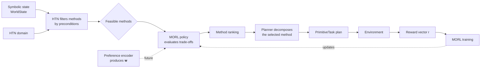
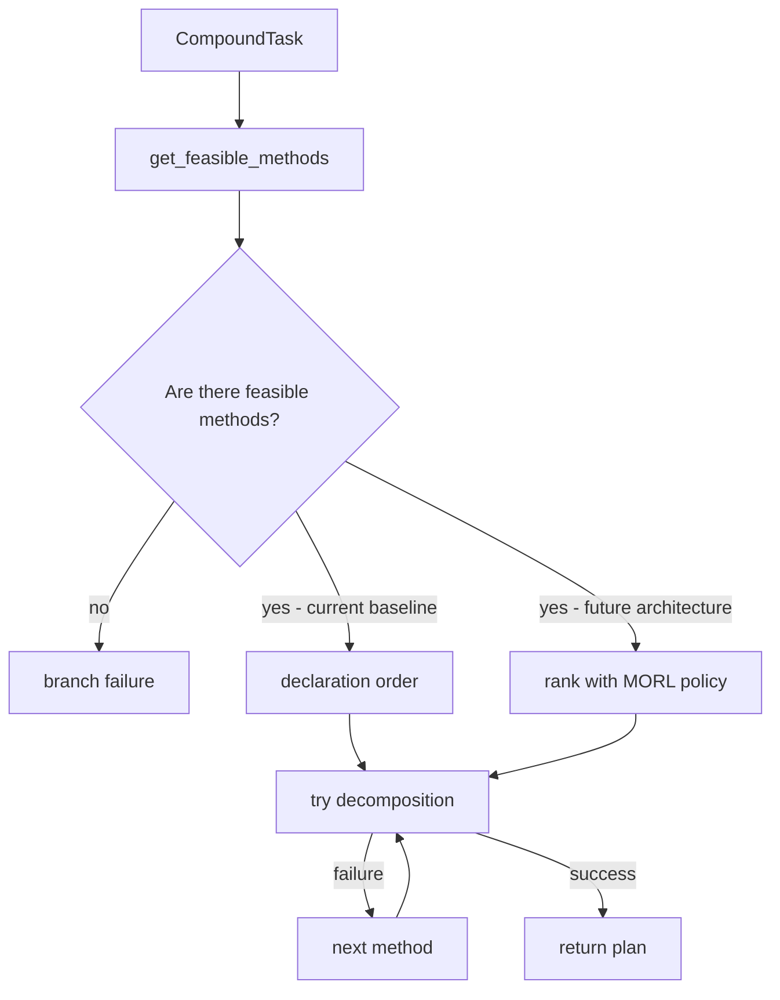

# Proposed architecture: MORL-guided HTN method selection

!!! warning "Research proposal — not implemented yet"
    This page describes the revised research architecture. The current code implements the HTN baseline with depth-first search, ordered methods, and backtracking. MORL method selection and preference encoders are not yet part of the runtime.

## Problem addressed by the architecture

In the baseline, the `Planner` filters methods by preconditions and tries feasible ones in declaration order. When a decomposition fails, it backtracks and tries the next one. This procedure produces the first valid plan, but does not distinguish equally applicable methods by strategic quality, cost, risk, or other objectives.

The proposal preserves HTN symbolic guarantees and adds a learned decision **only** among methods that are already applicable. Learning therefore prioritizes valid alternatives rather than replacing precondition checks or allowing actions outside the domain.

## Target architecture

### Layer responsibilities

| Layer              | Responsibility                                                                   |
|--------------------|----------------------------------------------------------------------------------|
| HTN                | Defines tasks, methods, preconditions, effects, and the decomposition structure. |
| Symbolic filter    | Eliminates methods whose preconditions are not satisfied in `WorldState`.        |
| MORL               | Evaluates or ranks the remaining methods according to multiple objectives.       |
| Executor           | Executes primitive tasks and observes results in the environment.                |
| Training           | Learns method values from vector rewards.                                        |
| Preference encoder | Supplies `𝐰` from context; it is an experimental, replaceable module.            |

## MORL at the planning-time decision point

In Multi-Objective Reinforcement Learning, the reward is no longer a scalar and becomes a vector:

$$
\mathbf{r} = [r_1, r_2, \ldots, r_k]
$$

Each component represents an objective, such as progress toward the goal, resource consumption, safety, or time. As these objectives may conflict, a policy can represent different trade-offs along the Pareto frontier.

A preference vector is written as:

$$
\mathbf{w} = [w_1, w_2, \ldots, w_k]
$$

It conveys each objective's relative importance for method selection. Changing $\mathbf{w}$ can change the choice for the same state and the same set of feasible methods. The MORL action is therefore a valid HTN `Method`, not a motor action or primitive task.

!!! info "Research focus"
    The central contribution is MORL-guided HTN method selection at planning time. Weight generation is needed to condition MORL, but it is not a standalone research focus: fixed profiles, rules, relational graphs, and deep-learning models are compared as interchangeable preference encoders.

See [preference-weight generation](preference-weight-generation.md) for the design and evaluation of these encoders, and [RL with Options](../annotations/reinforcement-learning/rl-with-options.md) for the temporal-abstraction connection.

## Proposed planner integration

Today, `CompoundTask.get_feasible_methods(world_state)` returns applicable methods and the planner tries each in declaration order. The proposed evolution is to introduce a ranking policy before the backtracking loop:

Backtracking remains necessary: a high score does not guarantee that the complete decomposition will be viable given simulated effects or environment changes. The learned policy is a prioritization heuristic, not a replacement for symbolic validation.

## Technical roadmap

1. **HTN baseline — available:** instrument method selection, failures, replanning, and environment outcomes.
2. **Multi-objective environment — future:** define the components of `r` and how each episode records returns.
3. **HTN–MORL integration — future:** introduce a ranking interface for feasible methods while preserving deterministic fallback and backtracking.
4. **Training — future:** learn a policy/value that estimates the trade-off for each feasible method.
5. **Preference encoders — experimental track:** compare fixed profiles, rules, relational graphs, and deep learning under the same MORL interface.
6. **Experimental comparison — future:** measure ordered baseline versus MORL prioritization, including plan validity, replanning, vector return, and decision cost.

## Implications for GridWorld

The current GridWorld is a good initial environment because it already has high-level alternatives: when the door is closed, the domain must ensure it has a key, open the door, and reach the goal. To experiment with MORL in practice, it will be necessary to add genuinely competing alternatives and rewards with more than one objective; in the current domain, method order is mainly a fixed execution rule.

See the [preference-weight generation](preference-weight-generation.md), [planner and agent guide](../framework/planning-runtime.md), and [domain, actions, and navigation](../grid-world/domain-and-actions.md).
