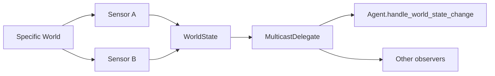

# Extensions and integrations

## Actions

Every concrete action inherits from `Action` and implements:

```python
def execute(self, world: World) -> ActionStatus:
    ...
```

An action must change the concrete world, not `WorldState` directly. Return `RUNNING` for multi-tick operations, `SUCCESS` when it reaches its goal, and `FAILURE` for an unrecoverable condition.

## Sensors and events

`Sensor[WorldT]` converts concrete data into symbolic facts through `sense(world, world_state)`. `SensorSystem` maintains a sensor list, calls each one in `update()`, and then triggers `on_world_state_changed`.



`MulticastDelegate` allows handlers to be added and removed, as well as invoked together. This decouples the observation source from event consumers.

## World and Gymnasium

`World` is the abstract context shared by actions and contains `world_state` and `agent`. `GymWorld` adds `env`, `last_obs`, `last_reward`, and `done`; subclasses must implement `update_from_obs(obs)` when using this generic adaptation.

In GridWorld, the `GridWorld` adapter class exposes the specific environment and delegates the `done` property to `env.done`.

## Pathfinder

The generic contract is `Pathfinder[NodeT, ContextT]`:

```python
def find_path(self, start: NodeT, goal: NodeT, context: ContextT) -> list[NodeT]:
    ...
```

It makes no assumptions about graphs, grids, or algorithms. An integration can provide A*, Dijkstra, or navmesh navigation, as long as the action interprets a node list. GridWorld uses `NodeT = tuple[int, int]`, `ContextT = GridContext`, and BFS.

## Checklist for a new environment

1. Define the concrete environment and a representation of positions or resources.
2. Create a `World` adapter for actions.
3. Write sensors that update every fact used by the domain.
4. Implement `Action`s, including their status contract.
5. Model `PrimitiveTask`s with coherent symbolic preconditions and effects.
6. Decompose goals into `CompoundTask`/`Method`.
7. Assemble `Domain`, `Planner`, `Agent`, `SensorSystem`, and the tick loop.
