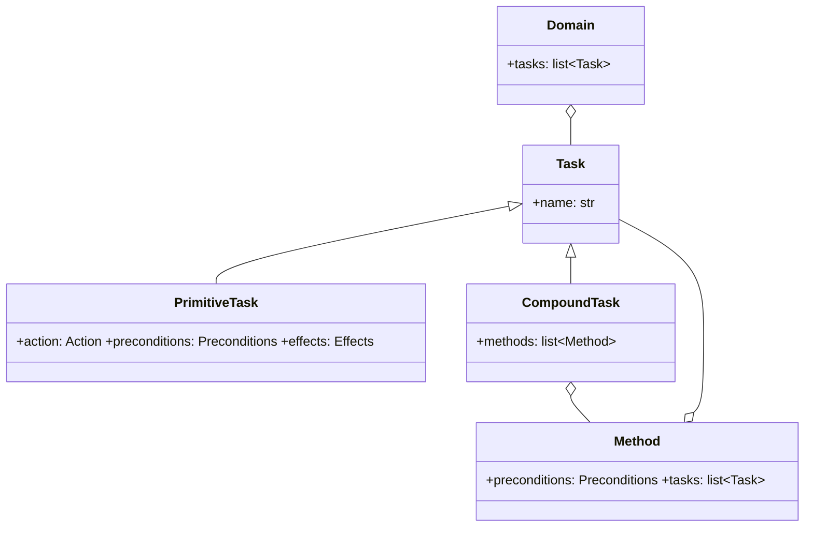

# Domain and state model

## `WorldState`: symbolic memory

`WorldState` is a mutable dictionary of facts: `dict[str, WorldValue]`, where `WorldValue` can be `bool`, `int`, `float`, or `str`.

```python
world_state.set_state("has_key", True)
world_state.set_state("energy", 10)
```

`copy()` produces a shallow copy of the fact map. This operation isolates planning simulation from the state observed at runtime.

## Tasks and methods



- **`PrimitiveTask`** is a leaf: it checks conditions, simulates effects, and wraps an executable `Action`.
- **`CompoundTask`** represents a high-level intent and lists alternative decompositions (`Method`).
- **`Method`** declares its own preconditions and an ordered list of subtasks. An empty list is a valid decomposition, useful for a *no-op* branch.
- **`Domain`** contains the root tasks, evaluated by the `Planner` in declaration order.

## Preconditions

```python
preconditions = {
    "has_key": ("=", True),
    "energy": (">=", 5),
}
```

The `Preconditions` type is `dict[str, tuple[ConditionOperator, WorldValue]]`. Supported operators are `=`, `!=`, `>`, `<`, `>=`, and `<=`.

A missing key causes the check to fail. Ordering comparisons require numeric values; invalid use raises `ValueError`. This makes a domain explicit: it does not silently treat missing information as false in comparisons.

## Effects

```python
effects = {
    "door_open": ("=", True),
    "energy": ("-", 2),
}
```

`Effects` uses the form `dict[str, tuple[EffectOperator, WorldValue]]`. Supported operators are `=`, `+`, `-`, `*`, `/`, `%`, `//`, `**`, and `not`.

| Category   | Requirement                                            |
|------------|--------------------------------------------------------|
| `=`        | replaces the value, including for a new key            |
| arithmetic | the key must exist and values must be numeric          |
| `not`      | the current value must be boolean                      |

Effects are predicted by the planner; operational confirmation comes from sensors after the real action.

## Minimal domain example

```python
unlock = PrimitiveTask(
    name="unlock",
    action=UnlockAction(),
    preconditions={"has_key": ("=", True), "door_open": ("=", False)},
    effects={"door_open": ("=", True)},
)

enter = CompoundTask(
    name="enter_room",
    methods=[Method(preconditions={"door_open": ("=", True)}, tasks=[unlock])],
)

domain = Domain(tasks=[enter])
```

In practice, a method for `enter_room` should decompose into a coherent sequence, such as obtaining a key, opening the door, and passing through. The example emphasizes that the subtask order in `Method.tasks` is the planning and execution order.
