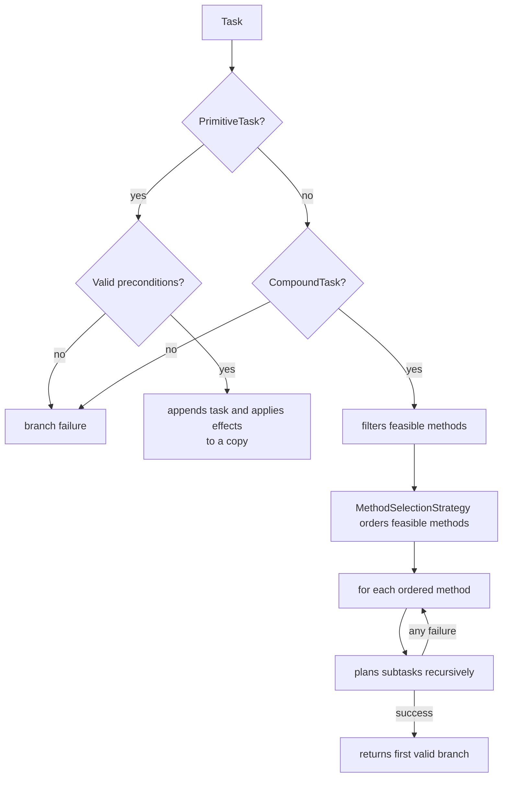
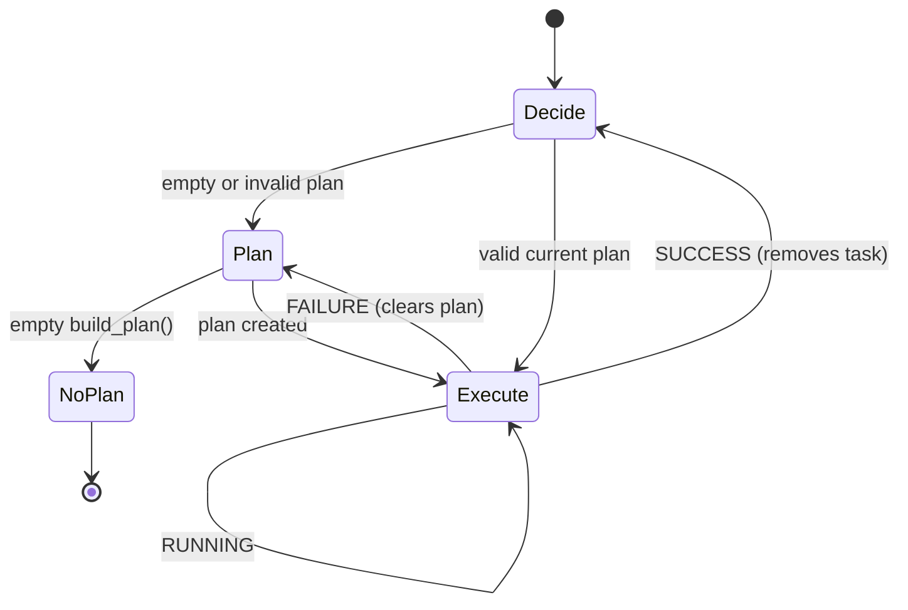

# Planner and agent

## Recursive planning and backtracking

`Planner.build_plan(tasks)` starts from a copy of `world_state_copy` and
traverses the caller-provided root tasks in order. For each task,
`recursive_planning()` returns either a pair of `(planned_tasks,
simulated_state)` or `None`. If a later root task cannot be planned, the
successfully planned prefix is returned; `None` is returned only when no
primitive task can be planned.



Backtracking occurs at the method level: if any subtask in a decomposition fails, that branch copy is discarded and the next feasible method is tested. The first method that produces all subtasks is chosen.

!!! warning "Order matters"
    `DepthFirstSearchStrategy` preserves declaration order and is the default
    used by the examples. Other strategies can rank the same feasible methods,
    but the planner still tests each ranked branch and backtracks after a
    decomposition failure.

## Method ordering

Pass a `MethodSelectionStrategy` when constructing a planner. The strategy is
called only after `CompoundTask.get_feasible_methods()` has applied the hard
preconditions:

```python
from htn.strategy import DepthFirstSearchStrategy

strategy = DepthFirstSearchStrategy()
planner = Planner(domain, world_state, strategy)
```

`HeuristicBasedSearchStrategy` is an abstract base for lower-is-better
application heuristics. `RLBasedSearchStrategy` stores an RL-agent reference,
but its base `order_methods()` intentionally raises `NotImplementedError`; a
subclass defines the policy or value-function interface. Neither strategy
removes HTN backtracking or makes an infeasible method valid.

## Planner state

`update_world_state()` replaces the snapshot with an observed copy and clears `_current_plan`. `build_plan()` uses a new local list; the plan being executed belongs to the `Agent`, so a sensor update does not automatically erase it.

## `Agent` state machine



Each `tick(world)` can rebuild a plan and execute one action. The `Agent`
retains a copy of its ordered root tasks and supplies that sequence for each
replanning attempt. `AgentTickResult` returns the task name, status, whether
replanning occurred, newly created plan names, the remaining plan, and an
optional message.

## Lazy replanning

A sensor update marks `_world_state_changed`, but does not immediately destroy the plan. Before replanning, `_is_plan_still_valid()` simulates the remaining primitive tasks from the current observation:

1. checks the task's preconditions;
2. applies its effects to the copy;
3. proceeds to the next task.

This allows a future action to depend on an effect from an earlier action that is still in the plan. A `ValueError` in a condition or effect safely invalidates the plan.

## Action statuses

| Status    | Effect on the plan                                         |
|-----------|------------------------------------------------------------|
| `RUNNING` | keeps the current task for the next tick                   |
| `SUCCESS` | removes the current task                                   |
| `FAILURE` | discards the entire plan; the next tick will plan again    |

An unexpected non-primitive task is removed and reported in a message. This is a defensive mechanism: in normal operation, the planner already returns only primitive leaves.
