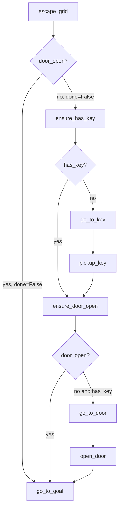
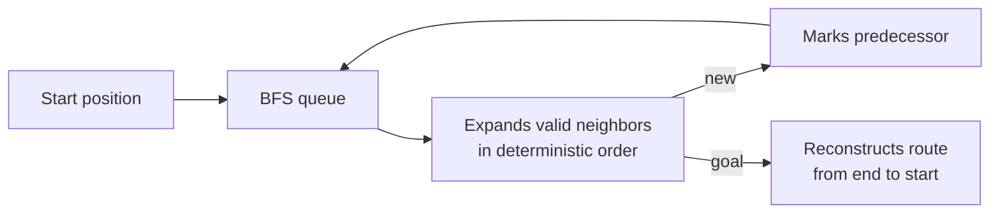

# Domain, actions, and navigation

## HTN domain

`build_grid_world_domain(env)` creates the domain from the environment's effective positions. Movement effects are built by `_position_effects()`, keeping coordinates and location predicates consistent during planner simulation.



The textual equivalent of the decomposition is:

```text
escape_grid
├── [done=False, door_open=True]  go_to_goal
└── [done=False, door_open=False]
    ├── ensure_has_key
    │   ├── [has_key=True]         (no-op)
    │   └── [has_key=False]        go_to_key → pickup_key
    ├── ensure_door_open
    │   ├── [door_open=True]       (no-op)
    │   └── [door_open=False, has_key=True] go_to_door → open_door
    └── go_to_goal
```

The *no-op* branches are deliberate: they express that a subgoal has already been satisfied without inserting an artificial action.

## Concrete actions

### `NavigateToPositionAction`

It receives a target position and a `GridPathfinder`. On each tick, it:

1. builds or uses the context with dimensions and blocked cells;
2. calculates a BFS route from the current position;
3. returns `FAILURE` if no next step exists;
4. converts the next adjacent step with `action_from_step()`;
5. calls `env.step(action_id)` to move one cell;
6. returns `RUNNING` until it reaches the target and `SUCCESS` once it does.

Recalculating the route on every tick makes navigation reactive to obstacles and positions that may change, at the cost of repeating BFS.

### `PickupKeyAction` e `OpenDoorAction`

Both call `env.step()` with the respective constant. The first succeeds when `env.has_key` becomes true; the second succeeds when `env.door_open` becomes true. If the environment does not accept the operation under current conditions, they return `FAILURE`.

## BFS and movement

`GridContext` is an immutable dataclass with `width`, `height`, and `blocked: frozenset[Position]`. `GridPathfinder.find_path()` uses breadth-first search, so it finds a path with the fewest steps in an unweighted grid.



The returned path includes the start and goal; if they are equal, the route contains only the start position. If the goal cannot be reached, it returns an empty list. `action_from_step()` accepts only orthogonal neighbors and fails on an invalid jump, protecting the contract between the pathfinder and environment.

!!! note "Door and pathfinding"
    The domain decides when to open the door. The blocked-cell configuration supplied to navigation must remain consistent with the door's concrete state so the calculated path is executable.
