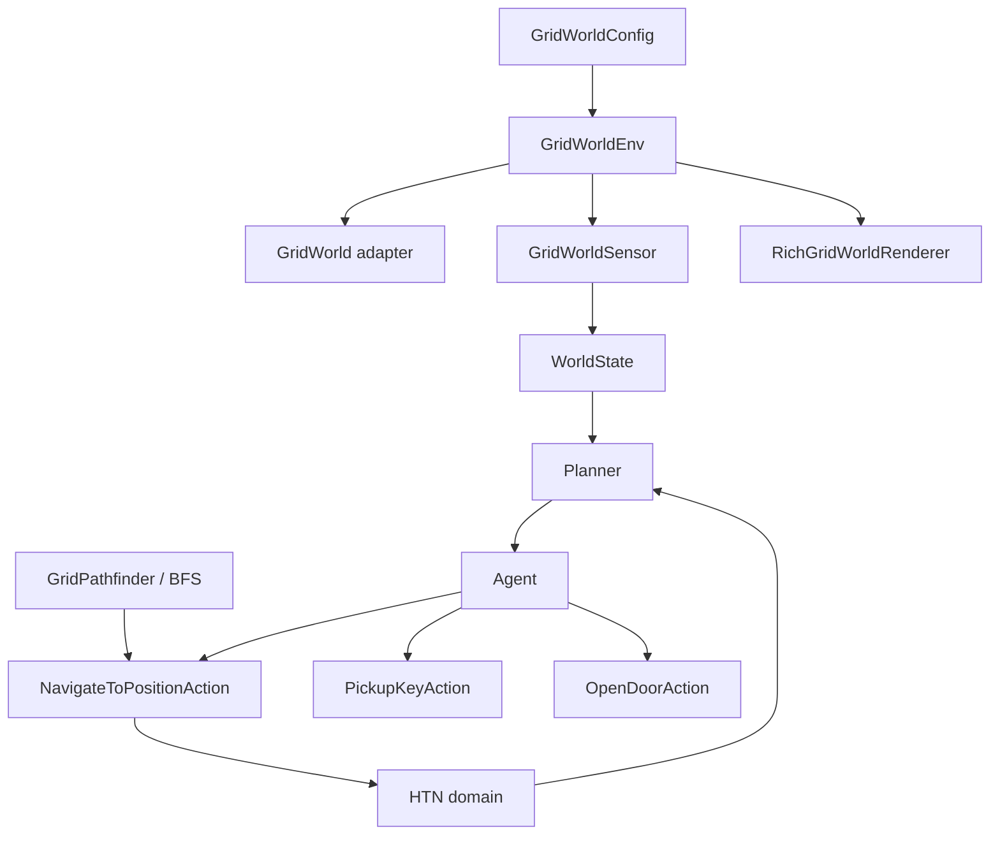

# GridWorld: overview

The `htn._examples.grid_world` package demonstrates the HTN runtime in a Gymnasium environment. The agent must reach the goal; if the door is closed, it must obtain the key and open it before final navigation.

## Goal and scenario

`GridWorldEnv` uses `(x, y)` coordinates. The default configuration is a deterministic 3×3 grid:

```text
A . K
. X .
G . D

A agent | K key | D closed door | G goal | X obstacle
```

The `main.py` script uses a different configuration: an 8×6 grid, two fixed barriers, five random obstacles, seed 42, and an initially open door. To demonstrate the complete **key → door → goal** sequence, set `initial_door_open=False`.

## Example components



| File            | Role                                                 |
|-----------------|------------------------------------------------------|
| `env.py`        | Gymnasium configuration and environment              |
| `pathfinder.py` | Grid context and BFS                                 |
| `movement.py`   | Converts an adjacent step into an environment action |
| `actions.py`    | World adapter and concrete HTN actions               |
| `domain.py`     | Domain, tasks, methods, and symbolic effects         |
| `sensors.py`    | Facts observed by the planner                        |
| `renderer.py`   | Terminal visualization through Rich                  |
| `main.py`       | Composition root and simulation loop                 |

Continue to [environment and configuration](environment.md) or see [domain, actions, and navigation](domain-and-actions.md).
