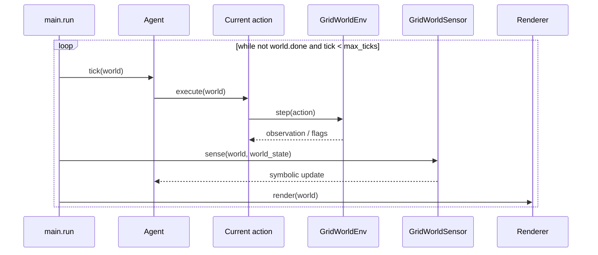

# Execution, sensors, and visualization

## Composition root

`main.py` connects all example components:

```python
env = GridWorldEnv(config)
env.reset(seed=42)

world_state = WorldState()
domain = build_grid_world_domain(env)
strategy = DepthFirstSearchStrategy()
planning_tasks = domain.tasks.copy()
planner = Planner(domain, world_state, strategy)
agent = Agent(planner, world_state, planning_tasks)
world = GridWorld(env, world_state, agent)

sensor_system = SensorSystem()
sensor_system.add_sensor(GridWorldSensor())
sensor_system.on_world_state_changed.add_handler(agent.handle_world_state_change)
sensor_system.update(world, world_state)
```

The first `update()` call is essential: it seeds `WorldState` before the `Agent` requests a plan. The example explicitly selects `DepthFirstSearchStrategy`, so feasible methods retain their domain declaration order, and copies the domain root tasks for the agent's persistent planning objective.

## Simulation loop



The tick limit protects the demonstration against unsolvable scenarios or domain bugs. The `Agent.tick()` result can be used to record the plan, status, and remaining tasks.

## Facts published by the sensor

`GridWorldSensor` publishes entity coordinates and derived predicates:

| Position facts       | State facts                    | Derived predicates             |
|----------------------|--------------------------------|--------------------------------|
| `agent_x`, `agent_y` | `has_key`, `door_open`, `done` | `at_key`, `at_door`, `at_goal` |
| `key_x`, `key_y`     |                                |                                |
| `door_x`, `door_y`   |                                |                                |
| `goal_x`, `goal_y`   |                                |                                |

The domain depends on these names. When adapting the example, update the sensor and preconditions/effects together; changing only one side makes the plan impossible or incorrect.

## Rendering and GIF

`RichGridWorldRenderer` creates terminal output and depends on `GridWorldLike`, a `Protocol` that describes only the fields required to visualize state. This lets it render compatible objects without coupling the renderer to the `GridWorldEnv` class.

The renderer uses `GridWorldTheme` for colors and symbols. The `gif_generator.py` utility converts SVG captures to GIF with `resvg_py` and Pillow; example artifacts are in the package's `images/` and `gif/` directories.

## How to run

With the environment synchronized, run the example module from the project root:

```bash
uv run python -m htn._examples.grid_world.main
```

If the layout, seed, or initial door state changes, rebuild the `Domain` after `env.reset()`, because it uses the environment's concrete positions to create symbolic effects.
