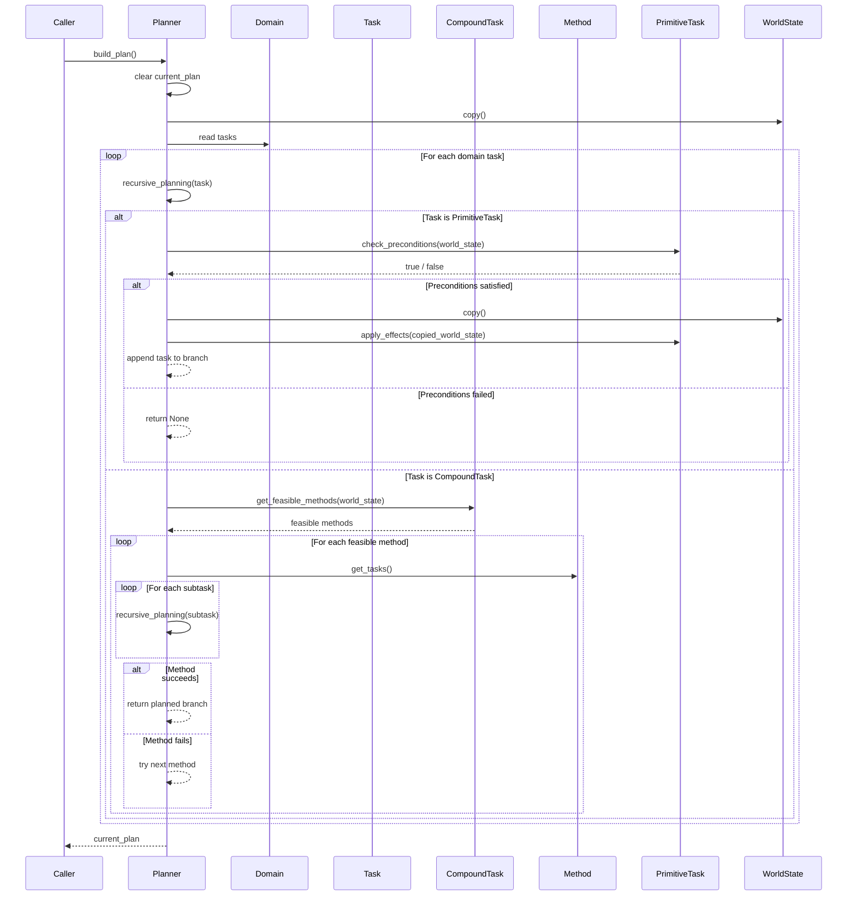
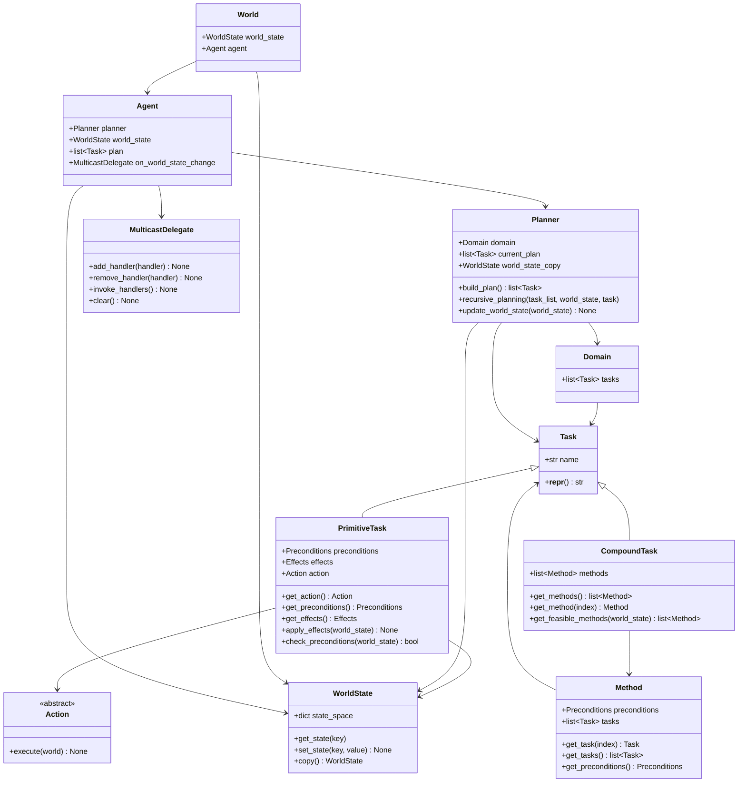
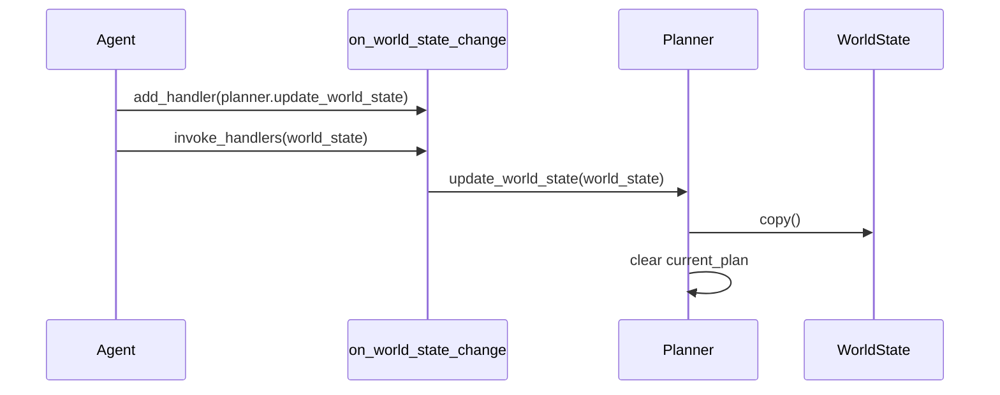

# HTN Module

Standalone implementation of a basic **Hierarchical Task Network** planner.

This module provides the core structures required to define hierarchical tasks, decompose compound tasks into primitive tasks, validate preconditions, simulate effects over a copied world state, and update the planner when the perceived world state changes.

---

## Current Implementation

The `htn` module currently implements:

- world state representation;
- condition checking;
- effect application;
- primitive tasks;
- compound tasks;
- methods for task decomposition;
- domain task container;
- recursive HTN planner;
- method-level backtracking;
- simulated world state during planning;
- abstract action interface;
- basic agent structure;
- multicast delegate for world state change notifications.

---

## Module Structure

```text
src/htn/
├── actions/
│   └── action.py
├── agent/
│   └── agent.py
├── delegates/
│   └── multicast_delegate.py
├── planner/
│   └── planner.py
├── tasks/
│   ├── domains/
│   │   └── domain.py
│   │
│   └── types/
│       ├── compound_task.py
│       ├── effects.py
│       ├── method.py
│       ├── preconditions.py
│       ├── primitive_task.py
│       └── task.py
├── world/
│   ├── state.py
│   └── world.py
│
└── utils.py
````

---

# Core Concepts

## WorldState

`WorldState` stores the current state of the world as key-value pairs.

```python
world_state.set_state("has_key", True)
world_state.set_state("door_open", False)
world_state.set_state("energy", 10)
```

Internally, the state is stored as:

```python
dict[str, WorldValue]
```

Where `WorldValue` currently supports:

```python
bool | int | float | str
```

`WorldState` provides:

* `get_state(key)`
* `set_state(key, value)`
* `copy()`

The planner uses `copy()` to simulate planning without mutating the real world state.

---

## Task

`Task` is the abstract base class for HTN tasks.

There are currently two concrete task types:

```text
Task
├── PrimitiveTask
└── CompoundTask
```

Each task has a `name`.

---

## PrimitiveTask

A `PrimitiveTask` represents an executable task.

It contains:

* an `Action`;
* `Preconditions`;
* `Effects`.

```python
PrimitiveTask(
    name="open_door",
    action=open_door_action,
    preconditions={
        "has_key": ("=", True),
        "door_open": ("=", False),
    },
    effects={
        "door_open": ("=", True),
    },
)
```

A primitive task can:

* check if its preconditions are satisfied;
* apply its effects to a given world state;
* expose its executable action.

Implemented methods:

```python
get_action()
get_preconditions()
get_effects()
check_preconditions(world_state)
apply_effects(world_state)
```

---

## CompoundTask

A `CompoundTask` represents a high-level task that must be decomposed.

It contains a list of `Method` objects.

```python
CompoundTask(
    name="enter_room",
    methods=[
        use_key_method,
        force_door_method,
    ],
)
```

Implemented methods:

```python
get_methods()
get_method(index)
get_feasible_methods(world_state)
```

`get_feasible_methods()` returns only the methods whose preconditions are satisfied by the current world state.

---

## Method

A `Method` represents one possible way to decompose a compound task.

It contains:

* preconditions;
* an ordered list of subtasks.

```python
Method(
    preconditions={
        "has_key": ("=", True),
    },
    tasks=[
        unlock_door,
        open_door,
        enter_room,
    ],
)
```

Implemented methods:

```python
get_task(index)
get_tasks()
get_preconditions()
```

---

## Preconditions

Preconditions are represented as:

```python
dict[str, tuple[ConditionOperator, WorldValue]]
```

Supported condition operators:

```text
=
!=
>
<
>=
<=
```

Example:

```python
preconditions = {
    "has_key": ("=", True),
    "energy": (">=", 5),
}
```

The function responsible for validating preconditions is:

```python
are_preconditions_satisfied(preconditions, world_state)
```

If a required key does not exist in the world state, the precondition fails.

---

## Effects

Effects are represented as:

```python
dict[str, tuple[EffectOperator, WorldValue]]
```

Supported effect operators:

```text
=
+
-
*
/
%
//
**
not
```

Example:

```python
effects = {
    "door_open": ("=", True),
    "energy": ("-", 2),
}
```

Effects are applied through:

```python
apply_effect(current_value, operator, value)
```

Primitive tasks apply effects using:

```python
task.apply_effects(world_state)
```

During planning, effects are applied only to a copied world state.

---

# Planner

The `Planner` is responsible for decomposing tasks into a plan.

It receives:

* a `Domain`;
* an initial `WorldState`.

```python
planner = Planner(domain, world_state)
```

The planner keeps:

```python
domain: Domain
current_plan: list[Task]
world_state_copy: WorldState
```

---

## Planning Entry Point

```python
build_plan() -> list[Task]
```

`build_plan()`:

1. clears the current plan;
2. validates that the domain exists;
3. validates that the world state copy exists;
4. creates a working copy of the world state;
5. iterates over the tasks registered in the domain;
6. recursively tries to plan each task;
7. appends successful planned tasks to `current_plan`;
8. returns the final plan.

---

## Recursive Planning

The core algorithm is implemented in:

```python
recursive_planning(
    task_list: list[Task],
    world_state: WorldState,
    task: Task,
) -> tuple[list[Task], WorldState] | None
```

The method handles two cases:

---

## Primitive Task Planning

For a `PrimitiveTask`, the planner:

1. checks task preconditions;
2. copies the current task list;
3. copies the current simulated world state;
4. appends the primitive task to the copied task list;
5. applies task effects to the copied world state;
6. returns the updated task list and simulated world state.

```text
PrimitiveTask
    ↓
Check preconditions
    ↓
Copy task list
    ↓
Copy world state
    ↓
Append task
    ↓
Apply simulated effects
    ↓
Return updated plan branch
```

---

## Compound Task Planning

For a `CompoundTask`, the planner:

1. gets feasible methods;
2. tries each feasible method;
3. copies the current task list;
4. copies the current simulated world state;
5. recursively plans each subtask in the selected method;
6. abandons the method if one subtask fails;
7. tries the next feasible method;
8. returns the first successful decomposition.

```text
CompoundTask
    ↓
Get feasible methods
    ↓
Try method
    ↓
Plan each subtask recursively
    ↓
If subtask fails, try next method
    ↓
If method succeeds, return planned branch
```

---

## Backtracking Behavior

The planner currently performs method-level backtracking.

If one method fails during recursive planning, the planner tries the next feasible method.

```text
CompoundTask
├── Method A
│   ├── Subtask A1
│   └── Subtask A2
├── Method B
│   ├── Subtask B1
│   └── Subtask B2
└── Method C
    ├── Subtask C1
    └── Subtask C2
```

If `Method A` fails, the planner tries `Method B`.

If `Method B` succeeds, its generated primitive tasks become part of the plan.

---

# Planning Sequence



---

# Class Diagram



---

# Agent

The current `Agent` implementation stores:

```python
planner: Planner
world_state: WorldState
plan: list[Task]
on_world_state_change: MulticastDelegate
```

During initialization, the agent registers the planner as a listener for world state changes:

```python
self.on_world_state_change.add_handler(planner.update_world_state)
```

This means the planner can receive an updated world state copy when the agent invokes the delegate.

The agent execution loop is not implemented yet in this module.

---

# MulticastDelegate

`MulticastDelegate` allows multiple handlers to be registered and invoked.

Implemented methods:

```python
add_handler(handler)
remove_handler(handler)
invoke_handlers(*args, **kwargs)
clear()
__contains__(event)
__len__()
```

It is currently used by the agent to notify the planner when the world state changes.

---

# Action

`Action` is an abstract base class.

It defines:

```python
execute(world: World) -> None
```

Concrete actions must implement this method.

The planner does not execute actions.
Actions are only stored inside primitive tasks, to be executed by the agent.

---

# World

`World` currently stores:

```python
world_state: WorldState
agent: Agent
```

It acts as a simple container for the current world state and the agent.

---

# Implemented Runtime Relationship

The implemented relationship between agent, delegate and planner is:



When `Planner.update_world_state(world_state)` is called, the planner:

1. copies the received world state;
2. stores it as `world_state_copy`;
3. it clears the current plan.

```python
def update_world_state(self, world_state: WorldState) -> None:
    self.world_state_copy = world_state.copy()
    self.current_plan = []
```

---

# Important Design Detail

The planner simulates effects over a copied world state.

It does not mutate the real world state during planning.

```text
Real WorldState
      │
      ▼
Copied WorldState
      │
      ▼
Planner applies simulated effects
      │
      ▼
Plan generated
```

This allows the planner to test whether a sequence of tasks is valid without executing actions in the real world.

---

# Current Limitations

The current `htn` module does not yet implement:

* concrete action classes;
* concrete example domain;
* agent execution loop;
* task execution status;
* running/success/failure action states;
* sensor classes;
* resource reservation;
* multi-agent concurrency control;
* test suite.

These features are outside the currently implemented code.
